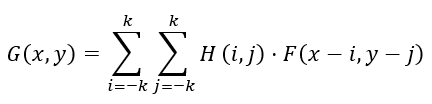

# 9

9. Линейная и нелинейная фильтрация изображений.

Фильтрация изображений — это фундаментальный этап предобработки в компьютерном зрении. Она применяется для подавления шумов, сглаживания, повышения резкости или выделения ключевых признаков (например, границ объектов).

В зависимости от математического аппарата, лежащего в основе преобразования, фильтры делятся на линейные и нелинейные.

1. Линейная фильтрация

Принцип работы

В линейной фильтрации значение выходного пикселя вычисляется как линейная комбинация (взвешенная сумма) значений пикселей его окрестности. Матрица весов называется ядром фильтра (kernel) или маской.

Основная математическая операция здесь — свертка (convolution) или взаимная корреляция. Скользящее окно (ядро) перемещается по изображению, перемножает свои коэффициенты на значения пикселей под ним и суммирует результат.

Формула двумерной свертки для пикселя с координатами (x, y):

Где F — исходное изображение, H — ядро фильтра размером (2k+1) \* (2k+1), а G — результирующее изображение.

#### Основные виды линейных фильтров:

- Усредняющий фильтр (Box Filter): Все элементы ядра имеют одинаковый вес (например, для матрицы 3 \* 3 все элементы равны 1/9). Применяется для грубого размытия и подавления случайного шума, но сильно размывает границы объектов.

- Фильтр Гаусса (Gaussian Blur): Веса элементов ядра рассчитываются по двумерной функции распределения Гаусса. Пиксели, расположенные ближе к центру ядра, имеют больший вес. Это позволяет сглаживать изображение более естественно, чем box-фильтр, эффективно справляясь с нормальным (гауссовым) шумом.

- Дифференцирующие фильтры (Собель, Лаплас, Шарр): Используются для поиска перепадов яркости (границ). Например, оператор Собеля аппроксимирует первую производную яркости по горизонтали или вертикали.

#### Плюсы и минусы:

- Плюсы: Высокая скорость вычислений (многие операции разделимы, например, двумерный Гаусс можно свести к двум одномерным), математическая предсказуемость.

- Минусы: Линейные сглаживающие фильтры неизбежно размывают резкие края и мелкие детали.

2. Нелинейная фильтрация

Принцип работы

В нелинейных фильтрах значение выходного пикселя нельзя выразить через простую взвешенную сумму соседних пикселей. Вместо этого над пикселями в скользящем окне выполняются логические, статистические или условные операции (сортировка, выбор экстремумов, вычисление медианы и т.д.).

#### Основные виды нелинейных фильтров:

- Медианный фильтр (Median Filter): Значения пикселей в окрестности сортируются по возрастанию, и в качестве нового значения центрального пикселя выбирается медиана.

  - Применение: Идеально устраняет импульсный шум (шум «соль и перец»). В отличие от фильтра Гаусса, медианный фильтр полностью сохраняет четкость контрастных границ, так как аномально яркие или темные пиксели-артефакты просто отбрасываются при сортировке.

- Билатеральный фильтр (Bilateral Filter): Продвинутый фильтр, который сглаживает шум, но строго сохраняет границы. При вычислении веса пикселя учитываются два фактора:

  - Пространственное расстояние (как в фильтре Гаусса) — близкие пиксели влияют сильнее.

  - Разница интенсивностей (колориметрическое расстояние) — если соседний пиксель сильно отличается по цвету/яркости от центрального, его вес падает практически до нуля. Это предотвращает «размытие» через границу объектов.

- Морфологические фильтры (Эрозия, Дилатация): Операции, основанные на поиске локального минимума (Erosion) или максимума (Dilation) в пределах структурирующего элемента. Используются для изменения формы объектов, удаления мелких деталей или разделения слипшихся контуров.
