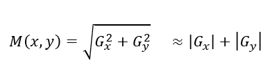
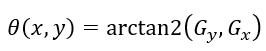
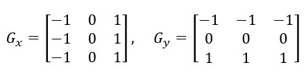
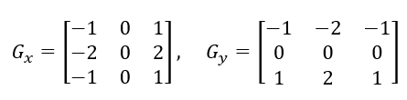

# 10

10. Алгоритмы обнаружения границ: Sobel, Prewitt, Canny.

Обнаружение границ — одна из важнейших задач в компьютерном зрении. Граница на изображении — это локальное изменение яркости, которое обычно указывает на физические границы объектов, смену глубины, изменение ориентации поверхности или свойств материала.

С математической точки зрения поиск границ основан на вычислении производных функции яркости изображения. В местах резкого изменения цвета первая производная принимает экстремальные (максимальные или минимальные) значения.

1. Операторы Прюитт (Prewitt) и Собеля (Sobel)

Оба этих алгоритма относятся к градиентным методам первого порядка. Они используют небольшие целочисленные ядра (матрицы свертки) размера 3\*3 для приближенного вычисления частных производных изображения по горизонтали ($\subscriptG,x$) и вертикали ($\subscriptG,y$). После применения ядер к изображению вычисляется полный вектор градиента $\DeltaI = \superscript\sbracelr\subscriptG,x, \subscriptG,y,T$.

- Величина градиента, показывающая силу границы:

- Направление градиента (перпендикулярно направлению самой границы):

Оператор Прюитт (Prewitt)

Использует простейшую аппроксимацию производной. Хорошо фиксирует горизонтальные и вертикальные линии, но он очень чувствителен к шуму, так как все пиксели в маске имеют одинаковый вес. Ядра для вычисления горизонтальных и вертикальных перепадов выглядят так:

Оператор Собеля (Sobel)

Является улучшенной версией оператора Прюитт. Чтобы снизить чувствительность к шуму, центральным пикселям строки или столбца придается больший вес, что эквивалентно легкому сглаживанию (размытию Гаусса) перпендикулярно направлению дифференцирования. Это делает оператор Собеля более устойчивым к высокочастотному шуму, из-за чего на практике он используется гораздо чаще оператора Прюитт.

- Минус Прюитт и Собеля: Результатом их работы являются довольно толстые размытые линии, а не четкие контуры толщиной в 1 пиксель.

### 2. Детектор границ Кэнни (Canny Edge Detector)

Разработанный Джоном Кэнни в 1986 году, этот алгоритм считается «эталонным» (оптимальным) методом обнаружения границ. Кэнни сформулировал три основных критерия идеального детектора:

- Низкая частота ошибок: Алгоритм должен находить все реальные границы и не реагировать на шум.

- Точная локализация: Расстояние между найденным пикселем границы и реальной границей должно быть минимальным.

- Один отклик на одну границу: Алгоритм не должен создавать несколько ложных пикселей там, где есть только одна четкая граница.

Детектор Кэнни — это многостадийный алгоритм. Он состоит из 4 основных шагов.

#### Шаг 1: Размытие Гаусса (Gaussian Blur)

Так как вычисление производных крайне чувствительно к шуму, изображение сначала сглаживается с помощью фильтра Гаусса. Размер ядра (например, 5\*5) выбирается в зависимости от уровня шума на исходном кадре.

#### Шаг 2: Поиск градиентов яркости

На сглаженном изображении вычисляются магнитуда M(x,y) и направление градиента $\Theta(x, y)$. Чаще всего на этом этапе применяется стандартный оператор Собеля. Направление градиента округляется до одного из четырех углов: 0॰, 45॰, 90॰ или 135॰.

#### Шаг 3: Подавление не-максимумов (Non-Maximum Suppression)

Эта стадия необходима для превращения «толстых» граней, полученных после Собеля, в тонкие линии толщиной в 1 пиксель.

- Для каждого пикселя алгоритм проверяет, является ли его величина градиента M(x,y) локальным максимумом в направлении градиента $\Theta(x, y)$.

- Если пиксель имеет максимальное значение среди своих соседей по направлению градиента, он сохраняется. В противном случае его значение обнуляется (подавляется).

#### Шаг 4: Двойная пороговая фильтрация и трассировка областей (Hysteresis Thresholding)

Одиночный порог часто приводит к «разрывам» линий из-за шума и изменения освещения. Кэнни решил эту проблему с помощью гистерезиса (двух порогов: верхнего и нижнего):

- Если значение пикселя границы выше верхнего, он объявляется сильной границей (точно сохраняется).

- Если значение ниже нижнего, пиксель подавляется (удаляется).

- Если значение лежит между верхним и нижним, пиксель считается слабой границей. Слабые границы сохраняются в итоговом результате только в том случае, если они физически соединены с сильными границами. Если слабая граница изолирована, она удаляется как шум. Это позволяет получить непрерывные контуры.
