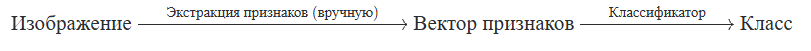
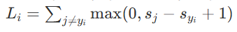
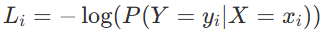

# 15

15. Классификация изображений традиционными алгоритмами машинного обучения.

- Суть и проблема: Базовая задача — присвоение метки (класса) изображению. Главная сложность заключается в «семантическом разрыве» (компьютер видит лишь тензор чисел от 0 до 255), а также в вариативности самих изображений (изменение освещения, ракурса, перекрытия объектов).

- Подход на основе данных (Data-Driven): Жестко запрограммировать алгоритм распознавания невозможно, поэтому модель обучается на размеченном наборе данных.

- Линейный классификатор: Использует параметрическую функцию f(x,W) = Wx + b, где x — вектор изображения, а W — матрица весов. Он вычисляет оценки (scores) принадлежности картинки к каждому классу.

- Обучение (Функции потерь): Функция потерь (Loss function) оценивает качество текущих предсказаний. Основные виды:

  - SVM (Hinge Loss): Следит за тем, чтобы оценка правильного класса была выше остальных минимум на заданную маржу (равную 1). Формула потерь для одного примера: 

  - Softmax (Cross-Entropy): Преобразует сырые оценки в вероятности и стремится максимизировать вероятность правильного класса. Функция потерь стремится максимизировать вероятность правильного класса:

- Оптимизация и регуляризация: Поиск оптимальных весов W осуществляется алгоритмом градиентного спуска. Для предотвращения слишком сильного подстраивания под тренировочные данные (переобучения) применяется регуляризация.

- Главный недостаток: Линейные модели бессильны в «сложных случаях» (hard cases), когда данные неразделимы линейно (например, расположены кольцами или изолированными группами). Для решения этой проблемы используются нелинейные алгоритмы — многослойные нейросети.
