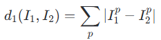
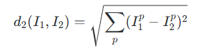

# 16

16. Применение метода k-ближайших соседей для распознавания изображений.

Суть метода: Алгоритм не настраивает веса (lazy learning), а просто запоминает

всю обучающую выборку (Train). Для классификации нового (Test) изображения

алгоритм рассчитывает расстояние от него до всех изображений из Train,

находит k самых похожих («ближайших соседей») и присваивает тестовому

кадру тот класс, который преобладает среди этих k соседей.

1. Метрики расстояния (как сравнивать изображения попиксельно)

Пусть I\_1 и I\_2 — два изображения (матрицы пикселей). Расстояние между ними

рассчитывается попиксельно (p — индекс пикселя):

- L1 (Манхэттенское расстояние):

- L2 (Евклидово расстояние):

2. Выбор гиперпараметров

Гиперпараметры (выбираются до запуска алгоритма с помощью кросс-валидации на

валидационном множестве):

1.  Число соседей k: При k=1 границы классов будут зашумленными, с ростом k они

сглаживаются, но при слишком больших k размываются мелкие детали.

2.  Выбор метрики: L1 или L2.

3. Вычислительная сложность

Пусть в обучающей выборке N изображений, а в тестовой — M:

- Время обучения (Train): O(1) (простое сохранение базы данных в памяти).

- Время предсказания (Test): O(N \\cdot M) (крайне медленно, так как каждый

тест нужно сравнить со всей базой данных).

В реальных приложениях критически важно быстро классифицировать на стадии работы

(Test) и допустимо долго обучаться (Train). k-NN работает ровно наоборот, что

является его главным практическим минусом.

4. Почему k-NN плохо работает на «сырых» пикселях

1.  Попиксельное расстояние не отражает смысл (семантику): Изображения с

одинаковым сюжетом (например, кошка), но при разном освещении, со

сдвигом на 1 пиксель или с другим фоном будут иметь гигантское L1/L2

расстояние друг от друга.

2.  Проклятие размерности: Пространство пикселей огромно. Чтобы плотно заполнить

его примерами для корректной работы k-NN, потребовалось бы экспоненциально

большое количество обучающих картинок.
