# 17

17. Метод опорных векторов (SVM) в задачах компьютерного зрения.

1. Классификация изображений

Вытягвание изображения HxWxC в вектор признаков H\*W\*C и построение поверх него метода опорных векторов

Плюсы:

Легко, просто, быстро

Минусы:

Чувствительность к малейшим изменениям в сложных объектах, квадратичная зависимость от размера картинки

2. HOG + SVM

Алгоритм HOG извлекает локальные признаки изображения, описывающие форму и контуры объектов через распределение направлений градиентов интенсивности. Его работа состоит из пяти последовательных шагов:

Шаг 1. Расчет градиентов по осям X и Y

Для каждого пикселя изображения рассчитываются горизонтальный 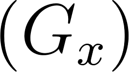 и

вертикальный 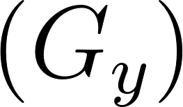 градиенты с помощью простых одномерных фильтров:

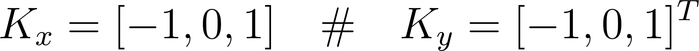

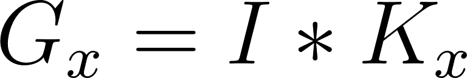, 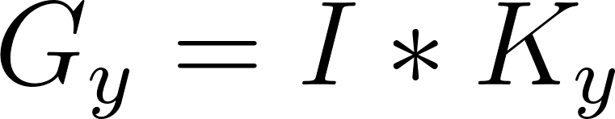

где I — интенсивность пикселей изображения, а

\* — операция свёртки.

Шаг 2. Вычисление амплитуды и направления градиента

На основе полученных проекций для каждого пикселя определяются:

- Амплитуда (величина изменения яркости):

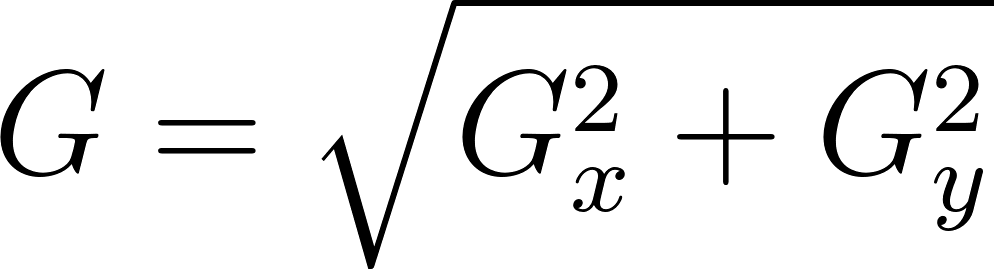

- Направление (ориентация вектора градиента):

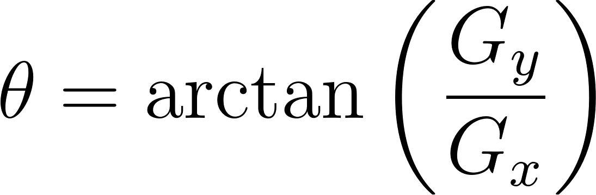

На практике чаще используют "беззнаковые" градиенты (unsigned), где угол 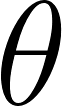 приводится к диапазону 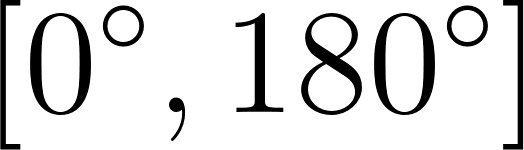.

Шаг 3. Разбиение на ячейки (Cells) и построение гистограмм

Изображение делится на небольшие связные области — ячейки (обычно размером 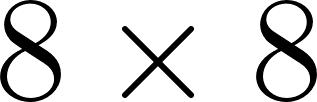 пикселей). Для каждой ячейки строится локальная гистограмма направлений градиентов:

1.  Ориентационный диапазон  делится на B интервалов (обычно B = 9 корзин по 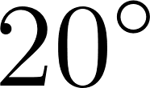 каждая).

2.  Каждый пиксель ячейки вносит вклад в соответствующую корзину гистограммы.

3.  Размер вклада пикселя пропорционален его амплитуде градиента G (иногда применяется линейная интерполяция между соседними корзинами для устранения эффекта резких границ интервалов).

Шаг 4. Группировка в блоки и нормализация контраста

Освещенность сцены может сильно варьироваться. Для компенсации этого эффекта ячейки объединяются в более крупные пространственные блоки (например, 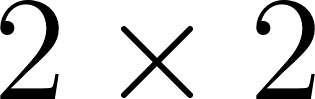 ячейки размером 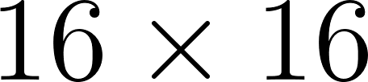 пикселей). Блоки обычно накладываются друг на друга с перекрытием (шагом в одну ячейку). Векторы гистограмм всех ячеек внутри блока объединяются в один вектор v и нормализуются (например, по

норме L2-Hys или стандартной L2-норме):

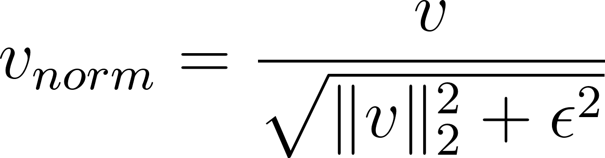

где  — малое число

для предотвращения деления на ноль.

Шаг 5. Формирование финального вектора признаков

Нормализованные векторы всех блоков конкатенируются в единый длинный одномерный вектор признаков. Этот вектор фиксированной длины и подается на вход классификатору SVM.

Применение:

- Детекция объектов со стабильной геометрией силуэта: обнаружение пешеходов, транспортных средств, дорожных знаков или лиц. (скользящее по картинке окно с применением вышеописанного алгоритма)

- Контроль качества и дефектоскопия: поиск трещин, царапин или геометрических отклонений деталей на заводских конвейерах.

- Поиск аномалий (One-Class SVM): выявление нетипичных объектов на сцене (например, посторонних предметов на путях).

Преимущества:

- Энергоэффективность: быстро работает на слабых процессорах (CPU) и микроконтроллерах без GPU.

- Устойчивость к освещению: внутренняя нормализация HOG нивелирует перепады яркости и теней.

- Эффективность на малых данных: SVM хорошо обобщает информацию и не требует огромных обучающих выборок.

Недостатки:

- Чувствительность к позе и ракурсу: метод не умеет распознавать деформируемые объекты (например, лежащего человека вместо стоящего).

- Низкая скорость детекции: поиск объектов разного масштаба требует сканирования кадра скользящим окном, что перегружает процессор.

- Ограничение точности: значительно уступает современным нейросетям на сложных кадрах.

3. SVM вместо Softmax после СNN

Пусть нейросеть (в данном случае CNN) обработала последовательность и на своем последнем скрытом слое сформировала вектор признаков (эмбеддинг) 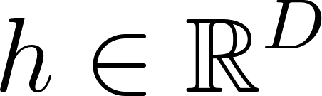, где  — размерность скрытого состояния.

В обоих подходах вектор h сначала проецируется на плоскость классов с помощью параметров финального полносвязного слоя — матрицы весов 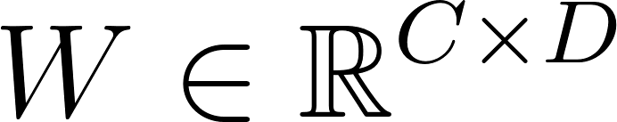 и вектора смещений 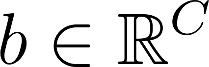 (где  — количество классов).

Вычисляются оценки классов (логиты) 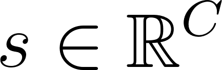:

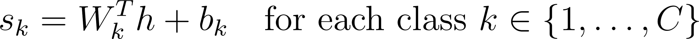

Ниже наглядно показана математическая цепочка от вектора логитов s до финального предсказания  и функции потерь для обоих случаев.

Вариант 1. Классический путь: CNN + Softmax

Тут, думаю, разжевывать не надо: Softmax + CrossEntropy loss.

Что стоит написать: такой подход “не дает покоя”, даже когда модель перестает ошибаться и требует всё больше разводить вероятности, делать предсказание более уверенным ((0.3, 0.7) превратить в (0.1, 0.9))

Вариант 2. Альтернативный путь: CNN + SVM (L2-SVM)

В этой схеме логиты интерпретируются геометрически как расстояния до разделяющих гиперплоскостей. Вероятности здесь не вычисляются. Для обучения нейросетей обычно применяется квадратичный вариант SVM (L2-SVM), так как его функция потерь дифференцируема во всех точках, что стабилизирует обратное распространение ошибки (backpropagation).

SVM - само преобразование выходов CNN в размерность классов, описанное выше

Математический путь:

1.  Расчет отступов: Каждое значение 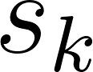 показывает, насколько далеко вектор признаков h находится от разделяющей границы класса k.

2.  Финальное предсказание: Выбирается класс, для которого расстояние до разделяющей плоскости максимально: 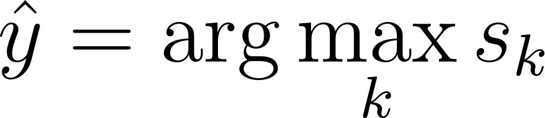

3.  Обучение (L2-SVM Loss с регуляризацией): Чтобы заставить сеть

максимизировать геометрический зазор, минимизируют

квадратичную шарнирную потерю в сочетании с регуляризацией весов

финального слоя 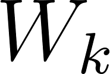 (норма Фробениуса 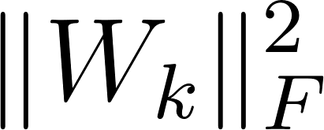):

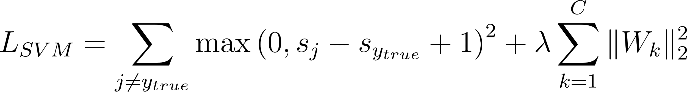

Здесь константа 1 — это жестко заданный безопасный зазор между классами.

В чем разница при обучении?

- Softmax постоянно «напрягает» сеть: Поскольку кросс-энтропия стремится к нулю только при вероятности 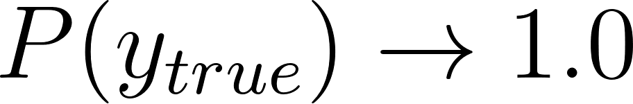, градиенты никогда не обнуляются. Сеть постоянно пытается увеличить разрыв между правильны логитом 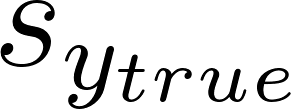 и всеми остальными, толкая его к бесконечности.

- SVM вовремя «останавливается»: Как только разница между правильным и неправильным логитами становится больше или равна единице 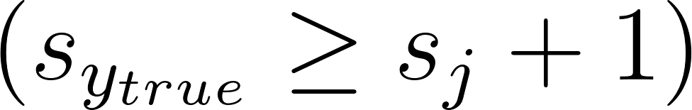, функция 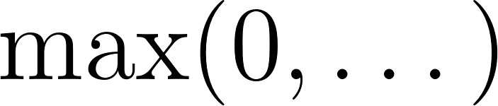 превращается в ноль.

Градиент по этому примеру зануляется, и сеть перестает корректировать свои внутренние веса ради этого конкретного объекта, фокусируясь только на тех примерах, которые попадают внутрь зазора или классифицируются неверно.

- Также: Softmax учитывает распределение всех точек (даже тех, что лежат далеко от границы), определяя им какую-то долю уверенности. SVM зависит только от опорных векторов (точек, лежащих на границе классов), поэтому на шумных датасетах часто ведет себя стабильнее.
