# 19

19. Искусственные нейронные сети: структура и принцип работы.

Искусственная нейронная сеть (ИНС) — это математическая модель, построенная по принципу организации биологических нейронных сетей. Она представляет собой систему взаимодействующих простых процессоров (искусственных нейронов), способную обучаться на примерах и выявлять сложные скрытые закономерности в данных.

Многослойная сеть способна реализовывать ВСЕ логические операции, на что не способна однослойная

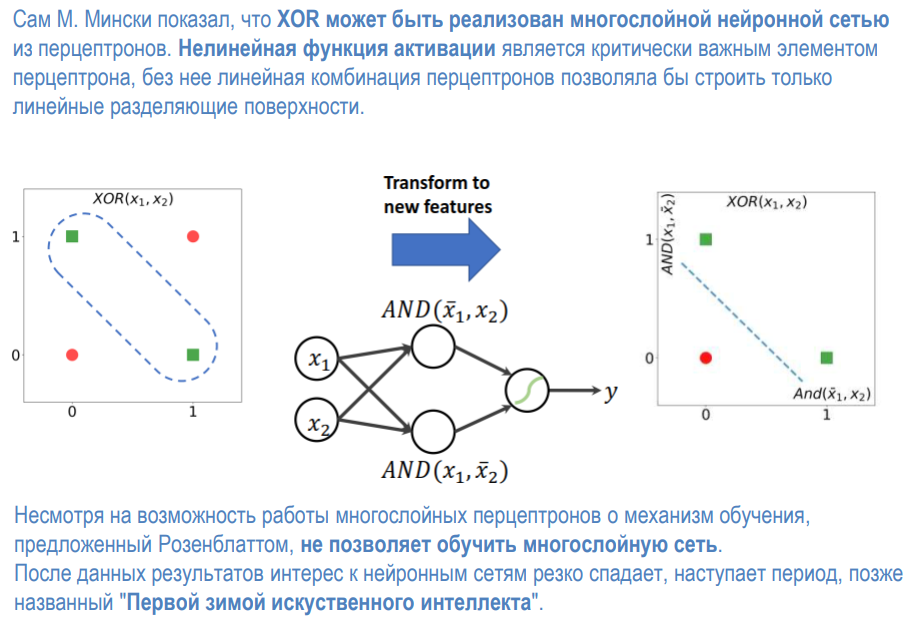

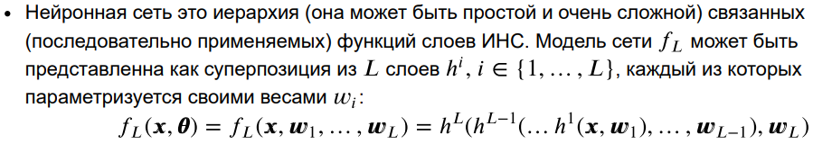

Принцип работы ИНС

Процесс функционирования и обучения сети делится на три повторяющихся этапа:

Шаг 1. Прямое распространение (Forward Propagation)

Сигнал последовательно передается от входа к выходу. Для слоя l вычисления

выглядят следующим образом: 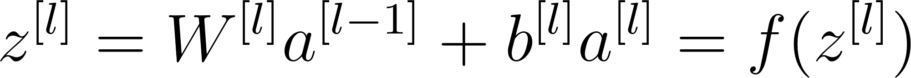 где 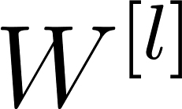 — матрица весов слоя l, а 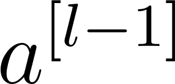 — вектор

выходов предыдущего слоя (для первого скрытого слоя 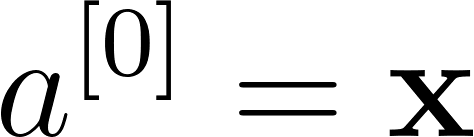).

Шаг 2. Расчет ошибки (Loss Function)

Полученный выход сети 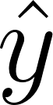 сравнивается с истинным значением y. Мерой ошибки

служит функция потерь 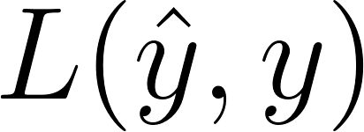.

- Пример (Среднеквадратичная ошибка MSE): 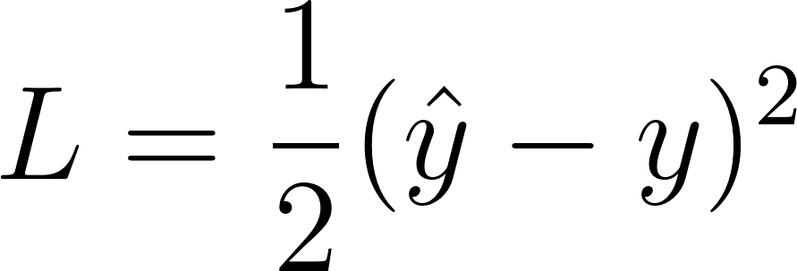

Шаг 3. Обратное распространение ошибки (Backpropagation) и градиентный спуск

Для минимизации ошибки необходимо скорректировать веса сети. Для этого

вычисляются частные производные функции потерь по всем параметрам сети

(градиенты) с использованием правила дифференцирования сложной функции (chain

rule):

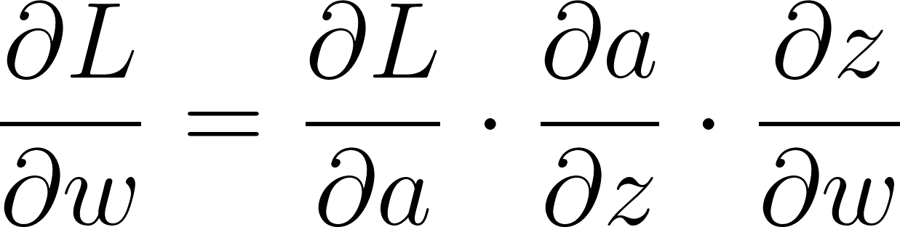

После нахождения градиентов веса и смещения обновляются по формуле градиентного спуска:

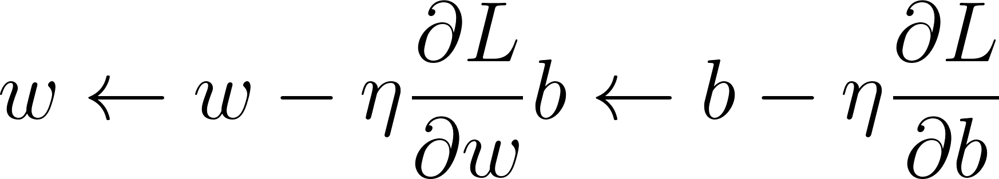

где  (learning rate) — скорость обучения, определяющая величину шага оптимизации.
