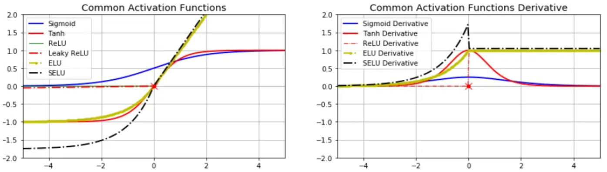
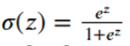
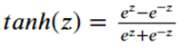
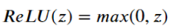
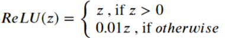
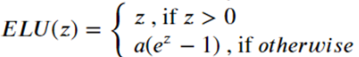
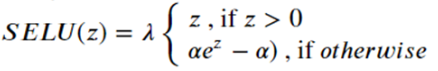

# 20

20. Основные функции активации в нейронных сетях.

Функция активации: Вносит «нелинейность» и решает, насколько сильно должен «активироваться» нейрон (передавать сигнал дальше или нет). Без неё нейронная сеть была бы просто набором линейных уравнений и не смогла бы решать сложные задачи.

Требования к функциям активации:

- функция должна быть монотонной (обычно монотонно неубывающая)

- иметь первую производную почти всюду (необходимо для обучении нейронной сети)

Популярные функции активации:

- Сигмоида (Sigmoid)

  - 

  - Сжимает входные значения в диапазон от 0 до 1.

  - Исторически была самой популярной. Сейчас используется в основном на выходном слое для задач бинарной классификации.

  - Плюсы: Имеет понятную вероятностную интерпретацию.

  - Минусы: Затухание градиентов (на краях графика функция почти плоская, градиент близок к 0, из-за чего глубокие сети перестают учиться). Также результат не центрирован относительно нуля.

  - В PyTorch: nn.Sigmoid() или torch.sigmoid()

- Гиперболический тангенс (Tanh)

  - 

  - Диапазон от -1 до 1 (по сути сдвинутая и растянутая сигмоида).

  - Для чего: Часто используется в скрытых слоях рекуррентных нейросетей (RNN) и в некоторых моделях генерации изображений.

  - Плюсы: Значения центрированы относительно нуля, что ускоряет сходимость.

  - Минусы: Так же, как и сигмоида, страдает от затухания градиентов при очень больших или маленьких входах.

  - В PyTorch: nn.Tanh() или torch.tanh()

- ReLU (Rectified Linear Unit)

  - 

  - Стандарт индустрии. Используется почти везде в скрытых слоях (сверточные сети, MLP).

  - Плюсы: Невероятно быстрая в вычислениях. Не затухает градиент при положительных значениях (ускоряет обучение в разы).

  - Минусы: Проблема "Dying ReLU" (Мертвые нейроны). Если нейрон попал в область отрицательных значений, он выдает 0 и его градиент становится 0 — он «умирает» и больше не обновляется.

  - В PyTorch: nn.ReLU() или torch.relu()

- Leaky ReLU

  - 

  - Похожа на ReLU, но для отрицательных значений есть небольшой наклон (обычно 0.01).

  - «Лекарство» от проблемы умирающих нейронов в обычном ReLU.

  - Плюсы: Нейрон никогда не «умирает» полностью, так как даже для отрицательных входов есть небольшой градиент.

  - Минусы: Появляется лишний гиперпараметр (коэффициент наклона), который нужно подбирать. На практике не всегда дает прирост по сравнению с ReLU.

  - В PyTorch: nn.LeakyReLU(negative\_slope=0.01)

- ELU (Exponential Linear Unit)

  - 

  - Для положительных — как ReLU, для отрицательных — плавная экспоненциальная кривая, стремящаяся к −α.

  - Попытка объединить плюсы ReLU (быстрота, нет затухания) и Tanh (центрированность относительно нуля).

  - Плюсы: Более плавная (дифференцируемая везде), среднее значение активаций ближе к нулю. Обычно работает точнее, чем ReLU, на глубоких сетях.

  - Минусы: Требует вычисления экспоненты, что чуть медленнее, чем простое сравнение в ReLU.

  - В PyTorch: nn.ELU(alpha=1.0)

- SELU (Scaled Exponential Linear Unit) (скобку игнорируем, очепятка)

  - 

  - Это ELU, умноженная на специальный коэффициент λ.

  - Разработана для самонормализующихся нейронных сетей (SNN).

  - Плюсы: Если использовать её вместе с правильной инициализацией весов (Lecun Normal), выходы каждого слоя будут автоматически иметь среднее 0 и дисперсию 1. Это позволяет строить очень глубокие сети без слоев Batch Normalization.

  - В этих целях параметры функции строго определены заранее: α = 1.67…, λ = 1.05…

  - Минусы: Работает «магическим» образом только при соблюдении строгих условий (специфическая инициализация весов и отсутствие некоторых других слоев, в т.ч. использование Alpha Dropout вместо обычного Dropout).

  - В PyTorch: nn.SELU()
