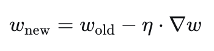
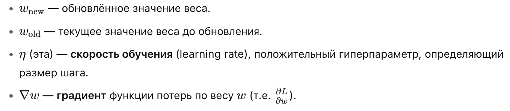

# 21

21. Алгоритм обратного распространения ошибки.

Обратное распространение ошибки (Backpropagation) — это эффективный метод вычисления градиента функции потерь по отношению к весам нейронной сети. Эти градиенты затем используются оптимизатором (например, SGD или Adam) для обновления весов с целью минимизации ошибки.

Математическая основа: Цепное правило

В основе метода лежит цепное правило дифференцирования сложной функции. Если представить нейронную сеть как композицию функций f(g(x)), то производная сложной функции вычисляется как произведение производных составляющих функций.

Для веса w в каком-либо слое сети градиент ошибки L вычисляется так:

$$ \\frac{\\partial L}{\\partial w} = \\frac{\\partial L}{\\partial y} \\cdot \\frac{\\partial y}{\\partial h} \\cdot \\frac{\\partial h}{\\partial w} $$

где:

y — выход сети,

h — выход скрытого слоя (активация),

w — вес.

Алгоритм работы:

1.  Прямой проход (Forward Pass): Данные проходят через сеть от входа к выходу. На каждом слое вычисляются линейные комбинации и функции активации. Промежуточные значения сохраняются (кэшируются), так как они понадобятся для вычисления производных.

2.  Вычисление ошибки: Сравнивается выход сети с целевым значением (target), вычисляется скалярное значение Loss.

3.  Обратный проход (Backward Pass): Ошибка распространяется от выходного слоя к входному. Для каждого слоя вычисляются локальные градиенты и умножаются на градиент, пришедший от следующего слоя (upstream gradient).

4.  Обновление весов: Вычисленные градиенты используются для корректировки весов:

