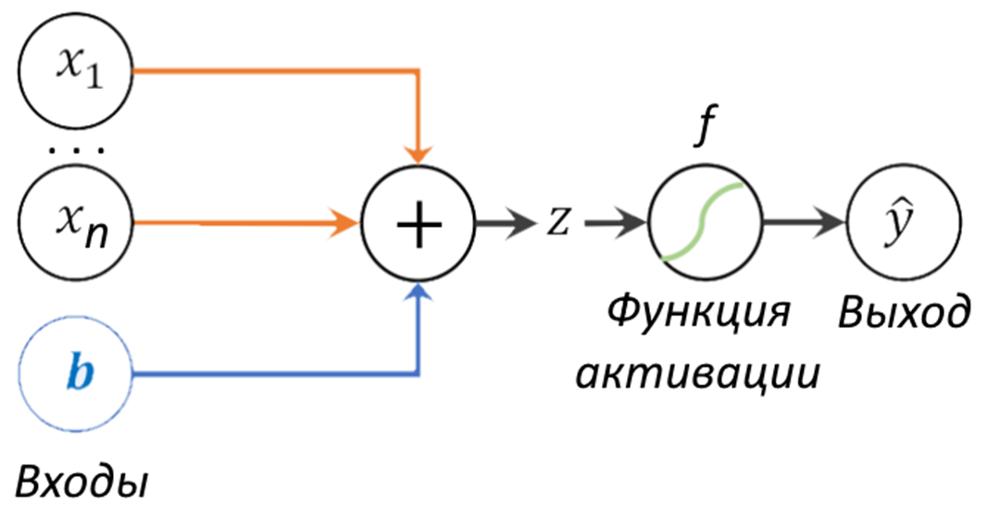
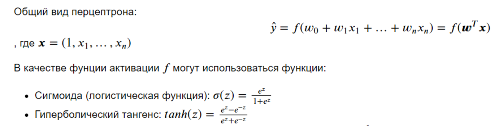
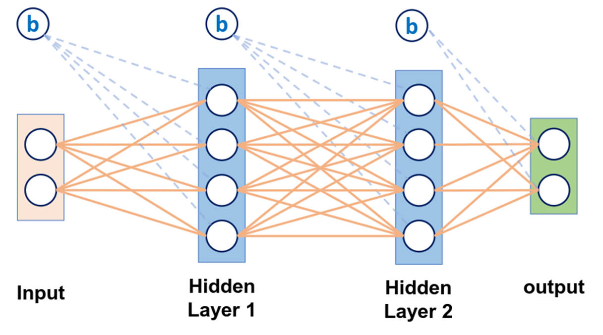

# 23

23. Архитектура многослойного перцептрона и его применение.

Модель перцептрона:

Входы: x\_i – признаки, b – смещение, дополнительный параметр, который прибавляется к сумме и позволяет нейрону быть более гибким (сдвигать результат активации влево или вправо, чтобы лучше подстроиться под данные).

Сумматор (+): Здесь происходит математическая операция. Нейрон складывает все взвешенные входы и добавляет смещение. Результат обозначается буквой z.

Функция активации (f): Вносит «нелинейность» и решает, насколько сильно должен «активироваться» нейрон (передавать сигнал дальше или нет). Без неё нейронная сеть была бы просто набором линейных уравнений и не смогла бы решать сложные задачи.

Итог: Нейрон берет данные → взвешивает их по важности (веса w) → складывает → пропускает через функцию активации → выдает ответ.

Один перцептрон (с любой функцией активации) может научиться классифицировать только линейно разделимые множества объектов.

Многослойный перцептрон

- x=(x1​,x2​,...,xn​)

- z=Wx+b

- a=f(z) - функция активации ReLU, sigmoid, tanh

Применение

Основные применения:

- классификация

- регрессия
