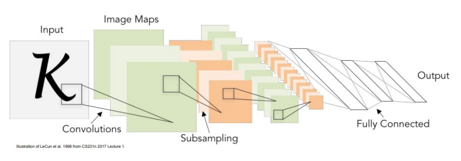
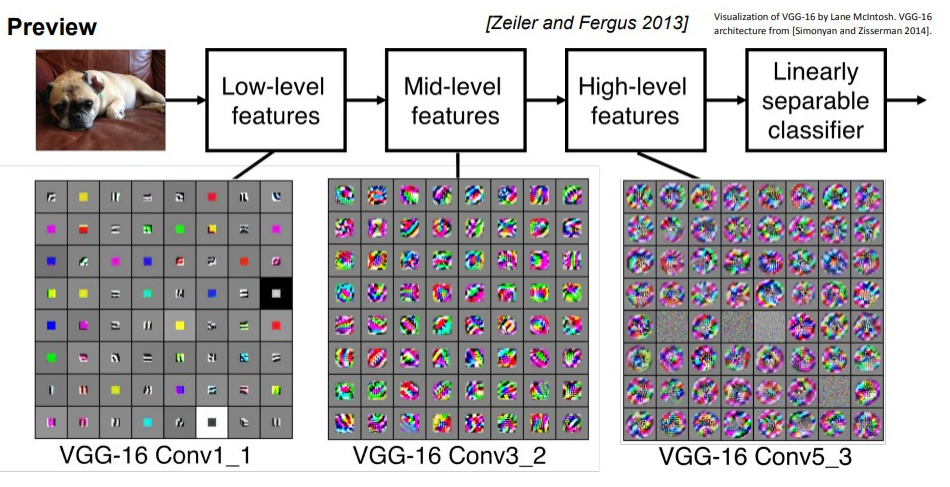

# 25

25. Сверточные нейронные сети (CNN): структура и основные компоненты

Сверточные нейросети — это развитие многослойных нелинейных классификаторов. Исторически архитектура берет начало со статьи Яна Лекуна 1998 года ("Gradient-based learning applied to document recognition").

Главная идея — построение иерархических представлений. Любую сложную функцию можно представить как суперпозицию более простых.

Структура и компоненты:

Сверточные слои: Основа сети. Ищут локальные шаблоны (признаки) на изображении.

Функции активации: Добавляют нелинейность.

Если убрать функцию активации (например, max(0,z), то многослойная сеть f=W\_2\*max(0, W\_1\*x) коллапсирует обратно в обычный линейный классификатор f=W\_3\*x. Современный стандарт— ReLU (max(0,x)).

Слои подвыборки (Pooling / Subsampling): Сжимают пространственные размеры карт признаков.

Полносвязные слои (Fully Connected): Ставятся в конце. Трехмерный тензор изображения (например, 32x32x3) вытягивается (stretch) в одномерный вектор (длиной 3072) и умножается на матрицу весов Wx. Выступает в роли "линейно разделимого классификатора".

Как они работают вместе:

Сеть (ConvNet) — это последовательность слоев. Классический шаблон архитектуры: CONV -> RELU -> POOL (повторяется несколько раз), а в конце идут слои FC.

Благодаря этому сеть извлекает признаки иерархически:

- Низкоуровневые: линии, углы, базовые цвета.

- Среднеуровневые: текстуры, простые геометрические узоры.

- Высокоуровневые: части объектов (морда собаки, колесо машины).

Обучение:

Сеть обучается алгоритмом обратного распространения ошибки (Backpropagation). Он позволяет автоматически вычислять градиенты в этих сложных вычислительных графах и обновлять веса фильтров.

Выводы по презентации:

1.Многослойные нелинейные классификаторы позволяют строить сколь угодно сложные разделяющие гиперповерхности.

2. Любую сложную функцию можно представить как суперпозицию более простых. Механизм обратного распространения ошибки позволяет вычислить градиенты для сколь угодно сложных вычислительных графов.

3. С помощью сверточных фильтров можно находить на изображении локальные шаблоны (признаки). По их комбинации и взаимному расположению можно многое сказать об изображении.
