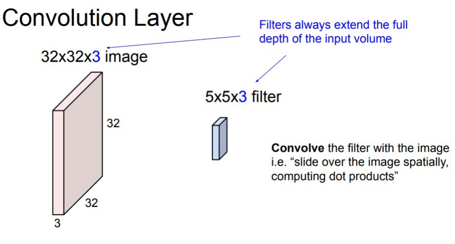
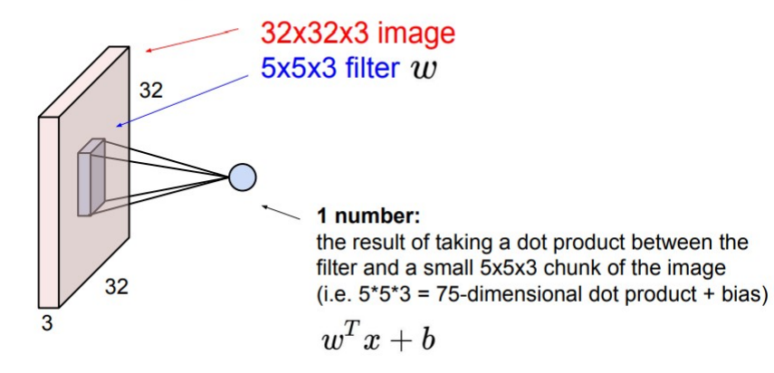
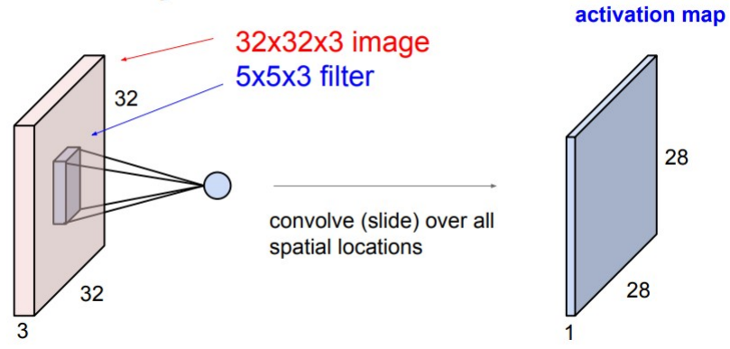
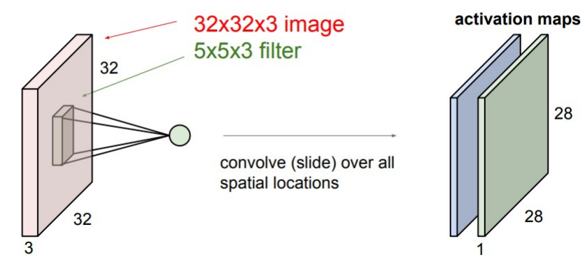
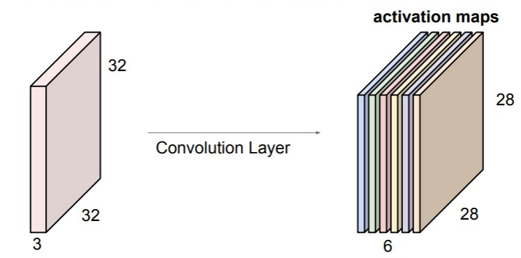

# 26

26. Операция свертки и её роль в обработке изображений

(на шпоры просто уберите картинки, они все описаны текстом)

Операция свертки — это процесс, при котором фильтр (матрица весов) скользит по изображению в пространственных координатах, вычисляя скалярные произведения.

Механика операции:

Глубина фильтра: Фильтр всегда захватывает всю глубину входного объема. Если на входе RGB картинка 32x32x3, то фильтр должен иметь размер, например, 5x5x3.

Математика: В каждом положении фильтра вычисляется скалярное произведение между весами фильтра (w) и небольшой областью изображения (x), плюс смещение (b). Формула: wTx+b. Результат этого вычисления — всегда одно число (скаляр).

Карта активации: Пройдя по всем пространственным позициям картинки, один фильтр формирует одну плоскую 2D матрицу. Например, из 32x32 получается 28x28.

Многоканальность: В слое используется не один фильтр, а набор. Если мы применим 6 разных фильтров 5x5x3, мы получим 6 отдельных карт активаций. Они складываются друг на друга, формируя "новое изображение" размером 28x28x6.

Роль в обработке изображений:

С помощью сверточных фильтров сеть находит локальные шаблоны (признаки). Делая выводы по их комбинации и взаимному расположению, сеть способна классифицировать объекты на изображении.

Дополнение (параметры свертки):

Хотя на слайдах показан результат изменения размера (32 -> 28), стоит добавить, как это контролируется:

Stride (Шаг): На сколько пикселей сдвигается окно. Больший шаг уменьшает выходной размер.

Padding (Отступ): Добавление нулей по краям картинки, чтобы размер после свертки не уменьшался (позволяет строить глубокие сети).
