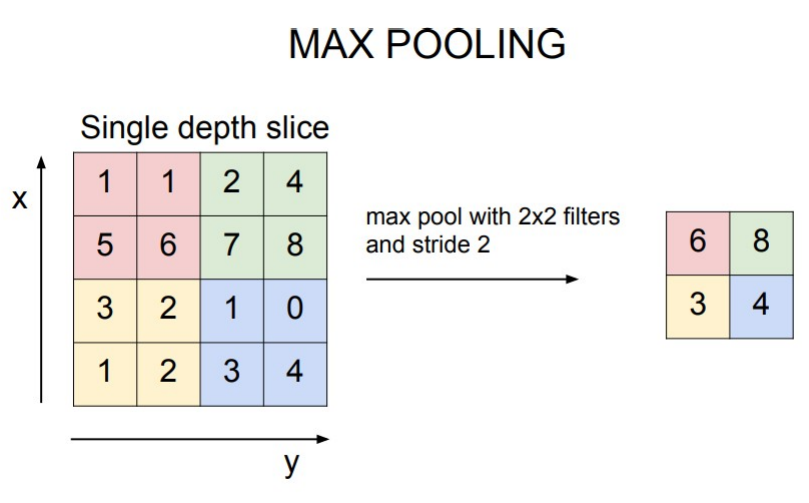
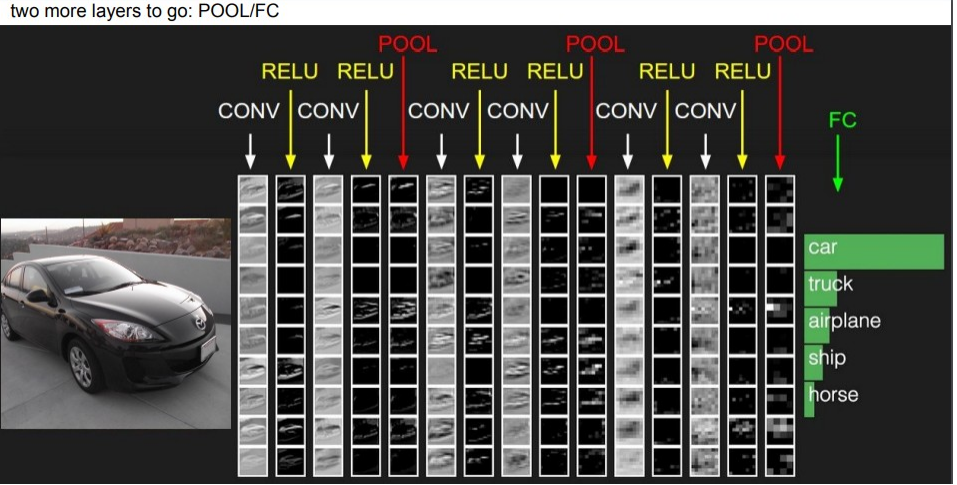

# 27

27. Слои pooling и их назначение

В презентации этот слой называется Pooling или Subsampling (как в ранних сетях). Разбирается на примере самой популярной вариации — Max Pooling.

Механика работы:

В отличие от свертки, пулинг применяется к каждому слою глубины независимо. Если на входе тензор из 6 карт активаций, пулинг пройдет по каждой из 6 отдельно, не смешивая их.

Используется "окно" (фильтр) без обучаемых весов. На слайде приведен стандартный пример: окно 2x2 и шаг (stride) 2.

Из области 2x2 выбирается максимальное значение. Таким образом, матрица 4x4 (16 пикселей) сжимается до 2x2 (4 пикселя).

Назначение:

Уменьшение пространственных размеров. Как видно на схеме, слои POOL последовательно уменьшают разрешение карт активаций, сохраняя при этом самые яркие (максимальные) отклики фильтров.

Снижение вычислительной нагрузки на последующие полносвязные (FC) слои.

Дополнение (почему еще это важно):

Борьба с переобучением: Меньше пространственное разрешение -> меньше параметров в сети -> ниже риск переобучения.

Инвариантность к сдвигу: Если объект на исходной картинке сместится на пиксель в сторону, максимальное значение внутри окна 2x2 всё равно останется тем же. Это делает сеть устойчивой к микро-сдвигам камеры.

Альтернативы: Кроме Max Pooling существует Average Pooling (усреднение) и Global Average Pooling (превращение целой 2D карты признаков в одно число, используется в конце современных сетей типа ResNet).
