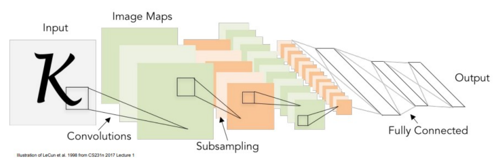
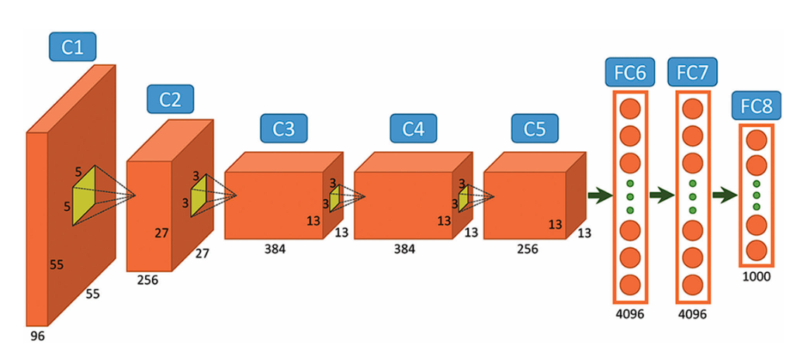
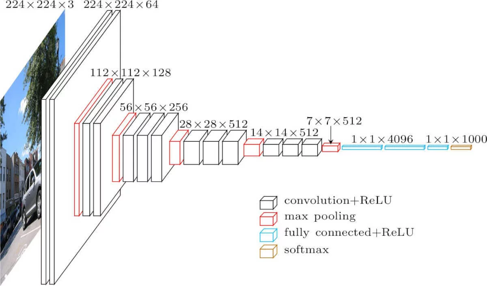
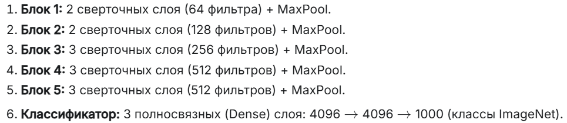
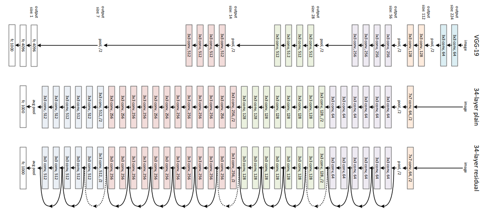
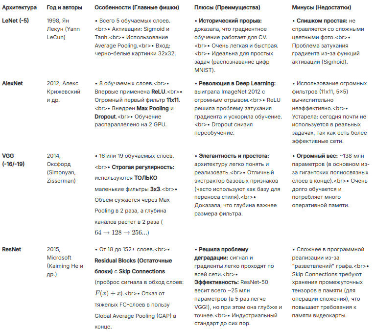

# 28

28. Архитектуры CNN: LeNet, AlexNet, VGG, ResNet

Внимание: В презентации подробно упомянута только архитектура LeNet (слайд 24) и есть микро-отсылка к VGG-16 (слайд 33). Они из презы + остальное - мое творчество с разнообразными друзьями.

С развитием вычислительных мощностей и алгоритмов обратного распространения (Backpropagation) архитектуры эволюционировали в сторону увеличения глубины.

1. LeNet (по презентации, Слайд 24)

История: Разработана Яном Лекуном в 1998 году ("Gradient-based learning applied to document recognition"). Первое успешное коммерческое применение CNN (распознавание почтовых индексов и чеков).

Архитектура: Состоит из чередующихся слоев свертки (Convolutions) и подвыборки (Subsampling = Average Pooling), завершающихся полносвязными слоями (FC). Использовались фильтры 5x5.

Особенности: Исторический фундамент, доказавший, что обучение на основе градиентов работает для визуальных данных.

На схеме LeNet5 из оригинальной статьи.

2. AlexNet

История: Совершила революцию в 2012 году, с гигантским отрывом выиграв конкурс ImageNet. Ознаменовала начало эры Deep Learning.

Архитектура и инновации: 8 слоев (5 сверточных, 3 FC).

Впервые применила ReLU как стандартную функцию активации, решив проблему затухания градиентов на ранних этапах.

Использовала слои Max Pooling.

Впервые применила Dropout для регуляризации полносвязных слоев.

3. VGG (по презентации, Слайд 33 + дополнение)

История: Создана в Оксфорде (Simonyan and Zisserman, 2014).

Главная инновация: Строгая регулярность. VGG полностью отказалась от больших сверток (11x11 или 5x5). В ней используются только маленькие фильтры 3x3 с шагом 1. Два слоя 3x3 дают такое же "поле зрения", как один 5x5, но содержат меньше параметров и имеют больше нелинейности (т.к. дважды применяется ReLU).

Архитектура VGG16:

- На вход слоя conv1 подаются RGB изображения размера 224х224.

- Далее изображения проходят через стек сверточных слоев, в которых используются фильтры с очень маленьким размером 3х3 (который является наименьшим размером для получения представления о том, где находится право/лево, верх/низ, центр).

- В одной из конфигураций используется сверточный фильтр размера 1х1, который может быть представлен как линейная трансформация входных каналов (с последующей нелинейностью).

- Сверточный шаг фиксируется на значении 1 пиксель. Пространственное дополнение (padding) входа сверточного слоя выбирается таким образом, чтобы пространственное разрешение сохранялось после свертки, то есть дополнение равно 1 для 3х3 сверточных слоев.

- Пространственный пулинг осуществляется при помощи пяти max-pooling слоев, которые следуют за одним из сверточных слоев (не все сверточные слои имеют последующие max pooling). Операция max-pooling выполняется на окне размера 2х2 пикселей с шагом 2.

- После стека сверточных слоев (который имеет разную глубину в разных архитектурах) идут три полносвязных слоя: первые два имеют по 4096 каналов, третий — 1000 каналов (так как в соревновании ILSVRC требуется классифицировать объекты по 1000 категориям (ImageNet); следовательно, классу соответствует один канал).

- Все скрытые слои снабжены ReLU. Отметим также, что сети (за исключением одной) не содержат слоя нормализации (Local Response Normalisation).

- Последним идет soft-max слой. Конфигурация полносвязных слоев одна и та же во всех нейросетях.

Недостатки VGG:

- Очень медленная скорость обучения.

- Сама архитектура сети весит слишком много (появляются проблемы с диском и пропускной способностью). Из-за глубины и количества полносвязных узлов, VGG16 весит более 533 МБ.

- Хотя VGG16 и используется для решения многих проблем классификации при помощи нейронных сетей, меньшие архитектуры более предпочтительны (SqueezeNet, GoogLeNet и другие).

4. ResNet (дополнение)

История: Представлена Microsoft Research в 2015 году. Решила проблему деградации глубоких сетей (когда добавление новых слоев приводило к росту ошибки из-за того, что градиенты не могли пройти в начало сети при Backprop).

Архитектура (Residual Network): Главное нововведение — Skip Connections (остаточные связи). Сигнал перепрыгивает через несколько сверточных слоев и складывается с их выходом: F(x)+x.

Преимущества: Позволила создавать сети глубиной в 50, 101 и даже 152 слоя. Градиенты во время обратного распространения свободно текут по этим "шорткатам", что делает обучение сверхглубоких сетей стабильным. Является стандартом индустрии сегодня.

Краткий вывод:

- LeNet доказала, что свертки работают, но "задохнулась" на сложных картинках.

- AlexNet взяла идею LeNet, сделала ее больше, добавила ReLU (чтобы градиент не затухал) и Dropout (чтобы не переобучалась), и порвала всех на ImageNet.

- VGG посмотрела на AlexNet и сказала: "Зачем нам огромные фильтры 11x11? Давайте возьмем много слоев 3x3, это эффективнее!". Сеть стала точнее, но невероятно "тяжелой".

- ResNet посмотрела на VGG и сказала: "Если мы просто будем добавлять слои, сеть деградирует. Давайте добавим шорткаты (Skip Connections) и выкинем тяжелые полносвязные слои!". В итоге получили сверхглубокую, легкую и самую точную сеть.
