# 32

32. Постановка задачи детекции объектов.

Детекция объектов — это задача CV, которая объединяет в себе две подзадачи: классификацию (определение того, что находится на изображении) и локализацию (определение того, где именно находятся объекты).

Дано:

Входное изображение 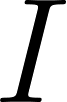 размерности  (где  — высота, 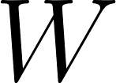 — ширина,  — количество каналов).

Заданное множество классов объектов 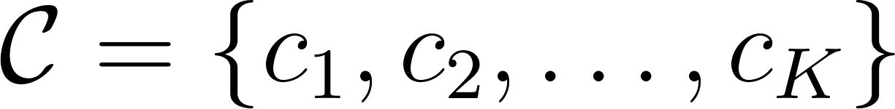, которые мы хотим детектировать.

Цель алгоритма:

Выдать список обнаруженных объектов на изображении: 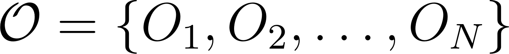

где  — число найденных объектов (переменная величина для каждого изображения).

Для каждого детектированного объекта 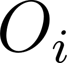 алгоритм должен предсказать кортеж: 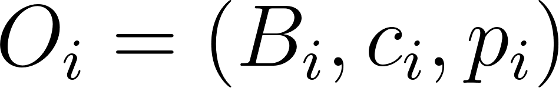

- 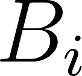 — Ограничивающая рамка: координаты области, в которой находится объект.

- Формат углов: 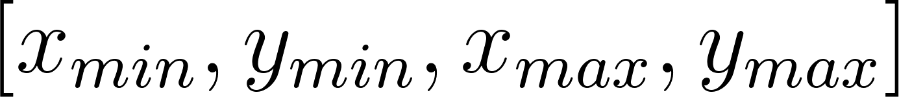 — координаты верхнего левого и нижнего правого углов.

- Формат центра: 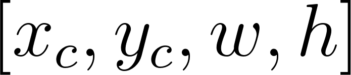 — координаты геометрического центра рамки, её ширина и высота.

- 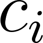 — Класс объекта: 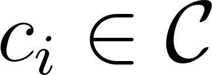

-  — Степень уверенности: вещественное число 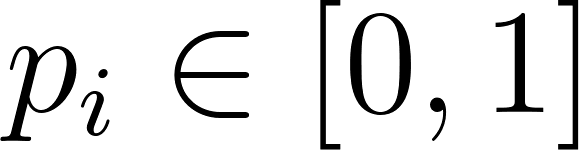, отражающее уверенность модели в том, что в этой области действительно находится объект класса .

Обучение детекторов объектов строится на оптимизации суммарной функции потерь, которая объединяет классификацию и регрессию координат:

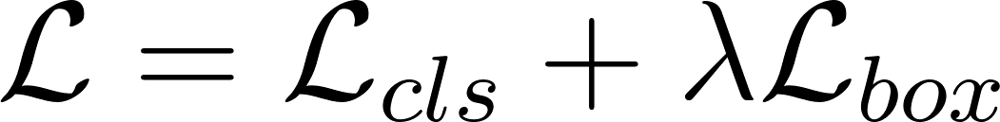
