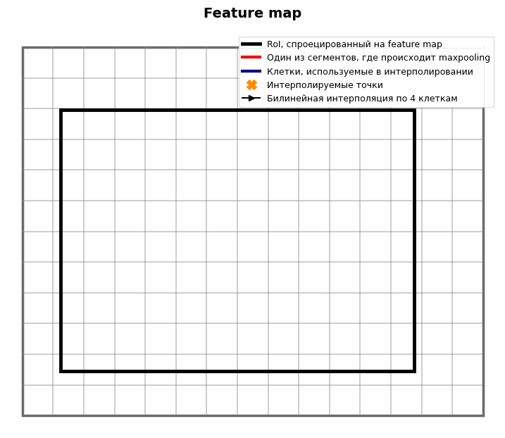

# 33

## 33. Методы детекции объектов: R-CNN, Fast R-CNN, Faster R-CNN.

### R-CNN ⇔ Region-based Convolutional Neural Network

1. Selective search - Предсказываются ~2000 потенциальных областей ROI

2. Каждая область приводится к разрешению 224x224

3. Каждая область проходит CNN блок

4. На выходе CNN - вектор

5. На векторах обучается SVM (тогда практика показывала что он лучше чем softmax слой на 3-4% mAP)

6. Параллельно используется линейная регрессия, чтобы уточнить координаты рамки (сделать её более плотной вокруг объекта)

RoI ⇔ Region of Interest

0. Часть изображения (не обязательно прямоугольник), в которой может быть объект. Bounding Box - ответ, RoI - предположение.

0.1. Почему RoI а не BBox сразу? В этом смысл двух+ стадийных моделей. Сначала кандидаты (RoI), потом реальные предсказания (BBox)

0.1. В RCNN - прямоугольник, в котором предполагается, что есть объект. В ходе работы RCNN это уточняется, как размеры и расположение. После всех фильтровок они становятся BBox

0.2. В Selective Search это сначала кляксы пикселей, на которых есть объект (как выделяются объекты в semantic segmentation). Их итеративно наращивают, соединяют, обрамляют рамками, и рамки в конце алгоритма - BBox

Selective search

Алгоритм выделения RoI, не нейросеть

1. Разбиение на суперпиксели методом Фельзеншвальба - начальные регионы

2.1 Вычисляется сходство S между регионами:

$$S(r\_i,r\_j) = \\alpha\_1 S\_{color} + \\alpha\_2 S\_{texture} + \\alpha\_3 S\_{size} + \\alpha\_4 S\_{fill}$$

$$S\_{color}$$ - пересечение гистограмм цветов (для каждого региона строится гистограмма 75 бинов, 25 на один канал)

$$S\_{texture}$$ - сходство гистограмм, каждая из 240 значений - градиенты в 8 направлениях для каждого канала

$$S\_{size} = 1 - \\frac{size(r\_i) + size(r\_j)}{size(image)}$$

$$S\_{fill}(r\_i,r\_j) = 1 - \\frac{size(BB\_{ij}) - size(r\_i)-size(r\_j)}{size(image)}$$

size($$BB\_{ij}$$) - площадь минимального BoundingBox который вмещает одновременно $$r\_i,r\_j$$

2.2 Регионы с максимальным S объединяются в новый $$r\_{new}$$

2.3 Добавляется BoundingBox который описывает $$r\_{new}$$ в список RoI

2.4 удаляются старые $$r\_i, r\_j$$

### Fast R-CNN

1. Параллельно:

1.1 Вся картинка проходит предобученный CNN

1.2 Selective search - Выделяются ROI (BBox) на исходном изображении

2. ROI Pooling

3. Классификация + регрессия координат

RoI Pooling

0. Унифицирование размерности RoI через maxpooling с округлениями на feature map. Нужен для MLP.

0.1. Смысл в RCNN: хотим ROI для классификатора с разных feature map - чем выше размерность, тем больше информации о мелких объектах - сконкатенируем их и получим одновременно и высокую точность и семантическую насыщенность, но они разного размера. Для приведения к одной размерности делаем downsampling через pooling.

1. Предсказываются координаты RoI на исходном изображении

2. Координаты проецируются на feature map, получается область размерами HxW, H, W непрерывные

3. Полученная область делится на части с округлением, происходит maxpooling

4. Результат maxpooling всегда имеет заданные размерности

### Faster R-CNN

1. Картинка проходит backbone, вынимаем feature maps последнего слоя CNN блока

2. RPN на feature map из (1)

3. RoI Pooling / RoI Align с координатами из (2) на feature map из (1)

4. Детектор (MLP) на унифицированных векторах из (3) -> Ответ

RoI Align

0. Унифицирование размерности RoI через maxpooling с интерполяцией на feature map. Нужен для MLP.

0.1. Смысл в RCNN: хотим ROI для классификатора с разных feature map - чем выше размерность, тем больше информации о мелких объектах - сконкатенируем их и получим одновременно и высокую точность и семантическую насыщенность, но они разного размера. Для приведения к одной размерности делаем downsampling через pooling.

1. Предсказываются координаты RoI на исходном изображении

2. Координаты проецируются на feature map, получается область размерами HxW, H, W непрерывные

3. Полученная область виртуально делится на части

3.1 В каждой части билинейно интерполируются P точек. Обычно их 4, и расположены равноудаленно от друг друга и краев части. Интерполяция происходит по 4 ближайшим клеткам к интерполируемой точке.

3.2 Maxpooling для интерполированных точек внутри части

4. Результат maxpooling всегда имеет заданные размерности

Anchor boxes

Заранее заданные эталонные рамки разных размеров и соотношений сторон

Идут наборами по k штук

Обычно используется 3 масштаба ($$128^2, 256^2, 512^2$$) и 3 соотношения сторон (1:1, 1:2, 2:1) (k=9 рамок в итоге)

Где располагаются: на исходном изображении. Центр набора anchor boxes приставлен к каждому пикселю карты активации, этот пиксель проецируется на исходное изображение, вокруг него размещаются anchor boxes.

RPN ⇔ Region Proposal Network

1.0 Для каждого пикселя feature map HxW подразумевается k anchor boxes. Проецируя пиксель feature map на исходное изображение как центр, можно представить вокруг него k anchor boxes. Разница в геометрии anchor boxes не будет учитываться на этапе свертки, но предсказания будут делаться  подразумевая, что они все разные. По feature map сначала идет свертка 3x3 с выходом HxWxd, потом две свертки 1x1xd.

1.1 cls layer: По карте активации скользит маленькая сверточная (1x1xd, выход HxWx2k) сеть-классификатор, она определяет, есть ли объект или нет (дает два числа на anchor - foreground score, background score).

1.2 reg layer: По карте активации скользит маленькая сверточная (1x1xd, выход HxWx4k) сеть-регрессор, которая показывает, как изменить координаты каждого anchor boxes (tx​,ty​,tw,th)

(сети 1.1 и 1.2 работают параллельно)

2. Обрабатываются выходы двух малых сверточных сетей (без обучения, эвристики)

2.0 anchor boxes масштабируются под предсказания reg layer (1.2)

2.1 Упорядочиваются по уверенности предсказания (cls score)

2.2 NMS ⇔ Non-Maximum Suppression ⇔ Удаляются рамки с IoU выше заданного порога (обычно 0.7), оставляя одну с наибольшим confidence score

2.3 Выбор top-N рамок

Multi-Task Loss RPN:

$$L(\\{p\_i\\}, \\{t\_i\\}) = \\frac{1}{N\_{cls}} \\sum\_i L\_{cls}(p\_i, p\_i^\*) + \\lambda \\frac{1}{N\_{reg}} \\sum\_i p\_i^\* L\_{reg}(t\_i, t\_i^\*)$$

x,y - координаты центра ограничивающей рамки

w,h - ширина и высота ограничивающей рамки

$$t\_x,t\_y$$ - Безразмерные смещения центра относительно размеров анкора

$$t\_x = (x - x\_a) / w\_a, \\quad t\_y = (y - y\_a) / h\_a$$

$$t\_x^\* = (x^\* - x\_a) / w\_a, \\quad t\_y^\* = (y^\* - y\_a) / h\_a$$

$$t\_w,T\_h$$ - Логарифмическое масштабирование размеров

$$t\_w = \\log(w / w\_a), \\quad t\_h = \\log(h / h\_a)$$

$$t\_w^\* = \\log(w^\* / w\_a), \\quad t\_h^\* = \\log(h^\* / h\_a)$$

$$L\_{reg}(t\_i, t\_i^\*) = \\sum\_{j \\in \\{x,y,w,h\\}} \\text{smooth}\_{L1}(t\_{i,j} - t\_{i,j}^\*)$$

$$\\text{smooth}\_{L1}(x) = \\begin{cases} 0.5x^2 & \\text{if } |x| < 1 |x| - 0.5 & \\text{otherwise} \\end{cases}$$
