# 33

## 33. Методы детекции объектов: R-CNN, Fast R-CNN, Faster R-CNN.

### R-CNN ⇔ Region-based Convolutional Neural Network

1. Selective search - Предсказываются ~2000 потенциальных областей ROI

2. Каждая область приводится к разрешению 224x224

3. Каждая область проходит CNN блок

4. На выходе CNN - вектор

5. На векторах обучается SVM (тогда практика показывала что он лучше чем softmax слой на 3-4% mAP)

6. Параллельно используется линейная регрессия, чтобы уточнить координаты рамки (сделать её более плотной вокруг объекта)

RoI ⇔ Region of Interest

Часть изображения (не обязательно прямоугольник), в которой может быть объект. Bounding Box - ответ, RoI - предположение.

Selective search

Алгоритм выделения RoI, не нейросеть

1. Разбиение на суперпиксели методом Фельзеншвальба - начальные регионы

2.1 Вычисляется сходство S между регионами:

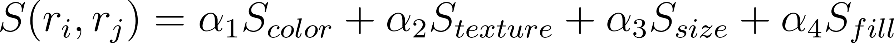

 - пересечение гистограмм цветов (для каждого региона строится гистограмма 75 бинов, 25 на один канал)

 - сходство гистограмм, каждая из 240 значений - градиенты в 8 направлениях для каждого канала

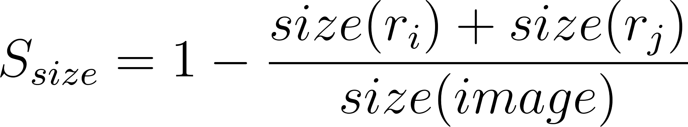

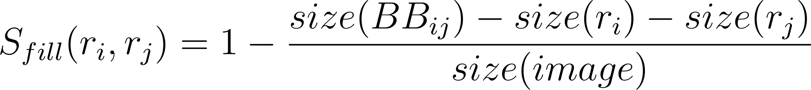

size(BB\_{ij}) - площадь минимального BoundingBox который вмещает одновременно 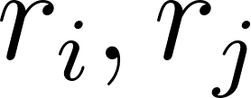

2.2 Регионы с максимальным S объединяются в новый 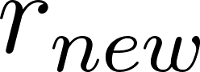

2.3 Добавляется BoundingBox который описывает  в список RoI

2.4 удаляются старые 

### Fast R-CNN

1. Параллельно:

1.1 Вся картинка проходит предобученный CNN

1.2 Selective search - Выделяются ROI (BBox) на исходном изображении

2. ROI Pooling

3. Классификация + регрессия координат

RoI Pooling

Унифицирование размерности RoI через maxpooling с округлениями на feature map. Нужен для MLP.

1. Предсказываются координаты RoI на исходном изображении

2. Координаты проецируются на feature map, получается область размерами HxW, H, W непрерывные

3. Полученная область делится на части с округлением, происходит maxpooling

4. Результат maxpooling всегда имеет заданные размерности

RoI Align

Унифицирование размерности RoI через maxpooling с интерполяцией на feature map. Нужен для MLP.

1. Предсказываются координаты RoI на исходном изображении

2. Координаты проецируются на feature map, получается область размерами HxW, H, W непрерывные

3. Полученная область виртуально делится на части

3.1 В каждой части билинейно интерполируются P точек. Обычно их 4, и расположены равноудаленно от друг друга и краев части. Интерполяция происходит по 4 ближайшим клеткам к интерполируемой точке.

3.2 Maxpooling для интерполированных точек внутри части

4. Результат maxpooling всегда имеет заданные размерности

### Faster R-CNN

1. Картинка проходит backbone, вынимаем feature maps последнего слоя CNN блока

2. RPN на feature map из (1)

3. RoI Pooling / RoI Align с координатами из (2) на feature map из (1)

4. Детектор (MLP) на унифицированных векторах из (3) -> Ответ

Anchor boxes

Заранее заданные эталонные рамки разных размеров и соотношений сторон

Идут наборами по k штук

Обычно используется 3 масштаба (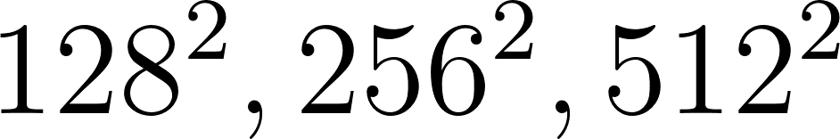) и 3 соотношения сторон (1:1, 1:2, 2:1) (k=9 рамок в итоге)

Где располагаются: на исходном изображении. Центр набора anchor boxes приставлен к каждому пикселю карты активации, этот пиксель проецируется на исходное изображение, вокруг него размещаются anchor boxes.

RPN ⇔ Region Proposal Network

1.0 Для каждого пикселя feature map HxW подразумевается k anchor boxes. Проецируя пиксель feature map на исходное изображение как центр, можно представить вокруг него k anchor boxes. Разница в геометрии anchor boxes не будет учитываться на этапе свертки, но предсказания будут делаться  подразумевая, что они все разные. По feature map сначала идет свертка 3x3 с выходом HxWxd, потом две свертки 1x1xd.

1.1 cls layer: По карте активации скользит маленькая сверточная (1x1xd, выход HxWx2k) сеть-классификатор, она определяет, есть ли объект или нет (дает два числа на anchor - foreground score, background score).

1.2 reg layer: По карте активации скользит маленькая сверточная (1x1xd, выход HxWx4k) сеть-регрессор, которая показывает, как изменить координаты каждого anchor boxes (tx​,ty​,tw,th)

(сети 1.1 и 1.2 работают параллельно)

2. Обрабатываются выходы двух малых сверточных сетей (без обучения, эвристики)

2.0 anchor boxes масштабируются под предсказания reg layer (1.2)

2.1 Упорядочиваются по уверенности предсказания (cls score)

2.2 NMS ⇔ Non-Maximum Suppression ⇔ Удаляются рамки с IoU выше заданного порога (обычно 0.7), оставляя одну с наибольшим confidence score

2.3 Выбор top-N рамок

Multi-Task Loss RPN:

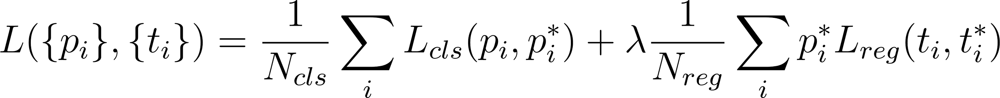

x,y - координаты центра ограничивающей рамки

w,h - ширина и высота ограничивающей рамки

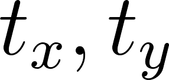 - Безразмерные смещения центра относительно размеров анкора

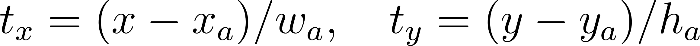

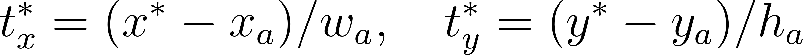

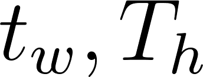 - Логарифмическое масштабирование размеров

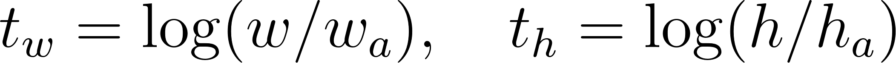

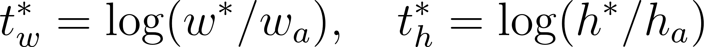

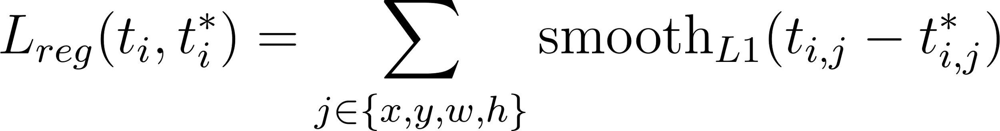

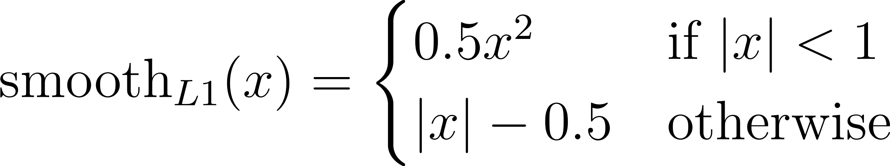
