# 34

## 34. Одностадийные детекторы объектов: YOLO и SSD.

0. Определения

0.1. Архитектура нейросетей:

0.1.1. Neck ⇔ Промежуточный блок агрегации ⇔ Блок нейронной сети, агрегирующий карты признаков разного разрешения из Backbone для передачи в финальный классификатор.

0.1.2. Head ⇔ Блок-предиктор ⇔ Слой или набор слоев-предикторов, формирующий итоговые предсказания: координаты BBox и вероятности классов.

0.1.1. Bottleneck ⇔ Вычислительный блок нейронной сети, уменьшающий число каналов тензора перед сверткой, а затем восстанавливающий их для экономии вычислений.

0.2. Алгоритмы обучения и потерь:

0.2.1. NMS ⇔ Non-Maximum Suppression ⇔ Алгоритм подавления немаксимумов. Удаление дублирующихся ограничивающих рамок для одного объекта на основе порога IoU.

0.2.2. Hard-negative mining ⇔ Майнинг сложных отрицательных примеров ⇔ Метод борьбы с дисбалансом классов при обучении путем отбора примеров фона, на которых сеть выдает наибольшую ошибку.

0.2.3. DFL ⇔ Distribution Focal Loss ⇔ Фокальная потеря распределения. Функция потерь и модуль сети, оценивающий непрерывное распределение вероятностей местоположения границ объекта.

0.2.4. STAL ⇔ Small-Target-Aware Label Assignment ⇔ Алгоритм назначения целевых меток, адаптированный для малых объектов.

0.2.6. Muon ⇔ Оптимизатор, использующий ортогональные обновления матриц весов для стабилизации и ускорения процесса обучения.

#### 1. Одностадийные детекторы объектов

0. Парадигма решения задач классификации и локализации объектов, при которой предсказания формируются за один прямой проход нейронной сети без эвристического выделения регионов-кандидатов (RPN).

1. Входное изображение подается в Backbone.

2. Карты признаков передаются в полносверточные слои Head, которые напрямую выводят координаты рамок и вероятности классов.

3. Отличаются высокой скоростью работы, но подвержены проблеме экстремального дисбаланса классов, так как алгоритм обрабатывает весь фон изображения, генерируя избыточное число отрицательных предсказаний.

#### 2. SSD ⇔ Single Shot MultiBox Detector

0. Одностадийный мультимасштабный детектор, выполняющий предсказания на картах признаков разного пространственного разрешения для обнаружения объектов разного размера.

1. Входное изображение фиксированного размера обрабатывается через Backbone.

2. Создание Default Boxes ⇔ Базовых шаблонов рамок:

2.1. Для предсказаний выбираются несколько Feature Maps с разных слоев Backbone.

2.2. Каждому пикселю карты признаков сопоставляется 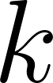 базовых рамок различных пропорций. Число  различается для каждой карты признаков.

3. Составление предсказаний:

3.1. К каждой карте признаков применяется Head, состоящий из двух параллельных сверточных сетей с размером ядра 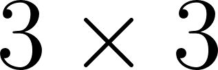.

3.2. Первая сеть предсказывает регрессию: смещение координат и изменение размеров относительно каждой базовой рамки. Выходной тензор имеет размерность 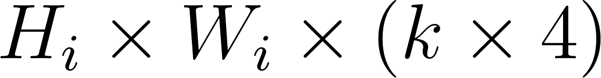.

3.2.1. 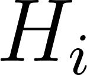 — высота карты признаков.

3.2.2. 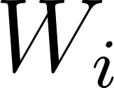 — ширина карты признаков.

3.2.3. 4 — параметры смещения по осям и изменения высоты с шириной.

3.3. Вторая сеть предсказывает классификацию. Выходной тензор имеет размерность 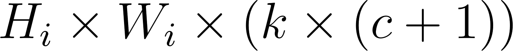.

3.3.1.  — количество классов объектов.

3.3.2. 1 — дополнительный класс фона.

4. На этапе Inference смещения координат со всех карт признаков переводятся в единый масштаб исходного изображения, объединяются в глобальный тензор, после чего для каждого класса применяется NMS.

5. На этапе обучения применяется Hard-negative mining: предсказания класса фона сортируются по невозрастанию показателя потери уверенности, после чего выбираются в соотношении 3 к 1 к объектам для расчета итоговой функции потерь.

#### 3. YOLO ⇔ You Only Look Once

0. Семейство одностадийных детекторов, основанное на разделении изображения на сетку. Каждая ячейка сетки предсказывает BBox и вероятности классов объектов, центр которых попадает в данную ячейку.

1. Макроархитектура современных версий концептуально состоит из трех частей: Backbone для извлечения признаков, Neck для создания пирамиды признаков разного масштаба и Head для вывода итоговых тензоров.

2. Эволюция вычислительных блоков:

2.1. CSP ⇔ Cross-Stage Partial Network. Входной тензор разделяется на две ветви по оси каналов. Первая ветвь проходит через серию блоков Bottleneck. Вторая ветвь передается через Skip Connection в обход вычислений. На выходе ветви проходят через конкатенацию. Это заставляет сеть изучать разные наборы признаков независимо и снижает затраты видеопамяти в 2 раза.

2.2. C2f ⇔ CSP Bottleneck with 2 convolutions, fast. Входной тензор проходит свертку и разделяется на ветви 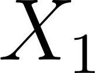 и 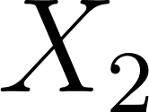. Ветвь  обрабатывается последовательностью из  блоков Bottleneck. Все промежуточные выходы каждого блока Bottleneck сохраняются и конкатенируются вместе с исходными ветвями: 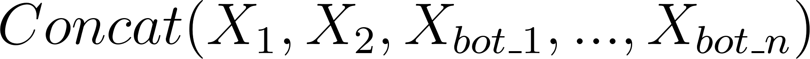. Алгоритм принудительно направляет градиенты ко всем внутренним слоям, что повышает точность обнаружения мелких объектов.

2.3. C3k2. Модификация блока C2f с возможностью изменения размеров ядер свертки внутри структуры. Размер ядра второго сверточного фильтра внутри Bottleneck является динамическим параметром и может быть увеличен до 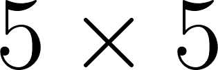. Локальное увеличение области видимости позволяет пикселям захватывать крупные паттерны без усложнения макроархитектуры.

2.4. SPPF ⇔ Spatial Pyramid Pooling Fast. Блок агрегации контекста. Входной тензор 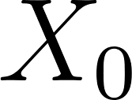 последовательно проходит через три операции MaxPool с окном  и шагом 1. Итоговый тензор формируется конкатенацией результатов: 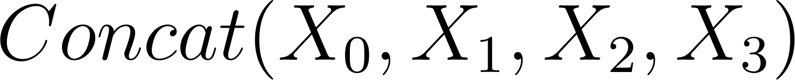. Математически эквивалентно параллельному применению пулингов с окнами , 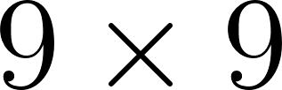 и 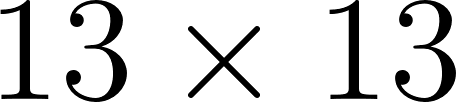, но требует меньшего числа вычислительных тактов.

2.5. PSABlock ⇔ Position-Sensitive Attention block. Блок пространственного внимания. Входной тензор разделяется на компоненты Query, Key и Value. Вычисляется матрица внимания путем перемножения матриц Query и Key с последующим применением функции Softmax. Матрица внимания умножается на тензор Value. Механизм позволяет сети учитывать математические зависимости между пикселями на больших расстояниях.

2.6. C2PSA ⇔ Cross-Stage Partial Position-Sensitive Attention. Интеграция механизма PSABlock в структуру разделения CSP. Одна из ветвей проходит через серию модулей PSABlock, после чего результаты ветвей конкатенируются. Объединяет глобальное поле восприятия и вычислительную эффективность за счет сокращения числа каналов.

#### 4. YOLOv26n ⇔ YOLO Version 26 nano

0. Самая легковесная модель 26-го поколения архитектуры YOLO, спроектированная для предельно быстрого Inference на Edge-устройствах при жестких аппаратных ограничениях по оперативной памяти и вычислительной мощности.

1. NMS-free Inference ⇔ Инференс без NMS. Сеть осуществляет сквозную генерацию итоговых предсказаний, полностью исключая алгоритм NMS из процесса. Это радикально снижает задержку обработки кадра центральным процессором.

2. Удаление модуля DFL. Модуль оценки распределения вероятностей удален из структуры. Вместо него применяется прямая регрессия координат границ объектов, что минимизирует вычислительные затраты и позволяет использовать тензорные ядра аппаратных ускорителей.

3. Dual-Head ⇔ Разделенный предиктор. Вычисление вероятностей классов и прямая регрессия координат BBox физически разнесены в две полностью независимые параллельные ветви Head без общих весов. Разделение препятствует интерференции задач при расчете без алгоритмического постпроцессинга.

4. Внедрение STAL. Алгоритм назначения меток принудительно увеличивает вес градиента ошибки на объектах, занимающих малую площадь. Это повышает метрику mAP для мелких паттернов при низком разрешении входного изображения.

5. ProgLoss ⇔ Прогрессивная функция потерь. Адаптивная функция динамически перераспределяет штрафы за ошибки классификации и локализации на разных этапах обучения сети, отдавая приоритет точности локализации на поздних эпохах.

6. MuSGD. Гибридный алгоритм оптимизации, объединяющий SGD с алгоритмом Muon. Модификация стабилизирует обновление матриц весов, компенсируя отказ от эвристики NMS и модуля DFL в процессе обучения.

7. Совокупность внедренных архитектурных изменений позволила повысить скорость обработки кадра на 30-43 процента по сравнению с Nano-моделями предыдущих поколений при идентичном размере входного тензора.

\_\_\_\_\_\_\_\_\_\_\_\_\_\_\_\_\_\_\_\_\_\_\_\_\_\_\_\_\_\_\_\_\_\_\_\_\_\_\_\_\_\_\_\_\_\_\_\_\_\_\_\_\_\_\_\_\_\_\_\_

кратко тезисно ключевое:

Принцип работы One-stage: вместо генерации кандидатов, изображение делится на сетку (grid), для каждой ячейки сетки сеть сразу предсказывает:

- Корректировку координат дефолтных рамок (Anchor Boxes)

- Вероятности классов для объектов внутри этих рамок

- NMS для фильтрации самых уверенных рамок (поздние yolo – NMS-free)

1. YOLO (You Only Look Once) – 2015 г.

- Принцип: Изображение делится на сетку (например, 7 × 7 в первой версии). Ячейка сетки отвечает за детекцию объекта, если центр объекта попал в эту ячейку.

- Особенность: Долгое время YOLO использовала одну фиксированную карту признаков (самую последнюю, глубокую) для предсказания объектов всех размеров, из-за чего плохо работала на мелких объектах. Начиная с версии YOLOv3, перешла на аналог SSD – архитектуру FPN (Feature Pyramid Network), чтобы делать предсказания на разных масштабах.

- Сильная сторона: Экстремальная скорость и глобальный контекст (YOLO видит всю картинку целиком при предсказании, поэтому реже путает фон с объектами). Всё ещё активно развивается.

2. SSD (Single Shot MultiBox Detector) – 2016 г.

- Принцип: Использует мультимасштабные карты признаков (Multi-scale feature maps). Предсказания берутся со сверточных слоев разной глубины.

- Особенность: Ранние (крупные) слои сети отвечают за поиск мелких объектов, а поздние (маленькие по разрешению, но глубокие) слои – за поиск крупных объектов.

- Сильная сторона: Исторически SSD лучше, чем ранние версии YOLO, справлялся с объектами разных размеров (особенно с мелкими) благодаря дифференциации слоев. Сейчас уступает последним версиям ёлки и по скорости, и по точности.
