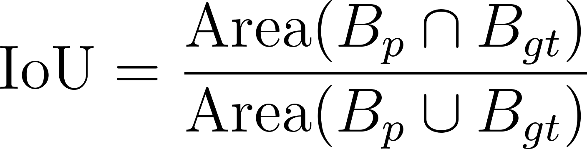
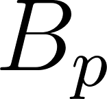
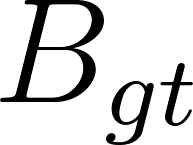
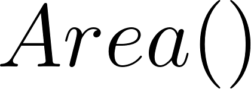
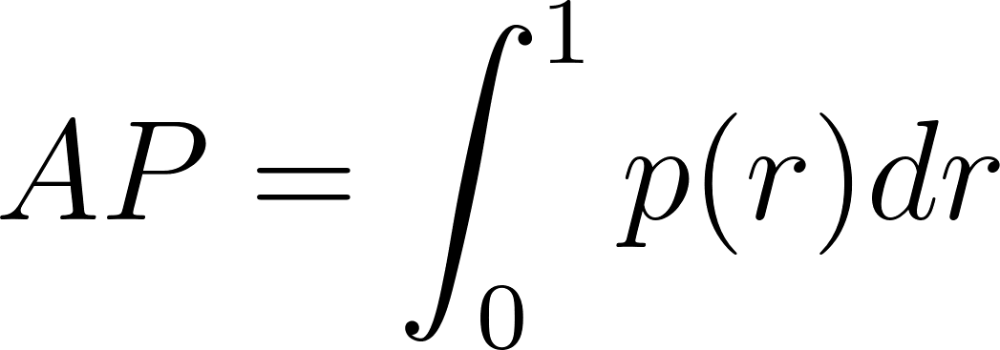
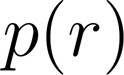
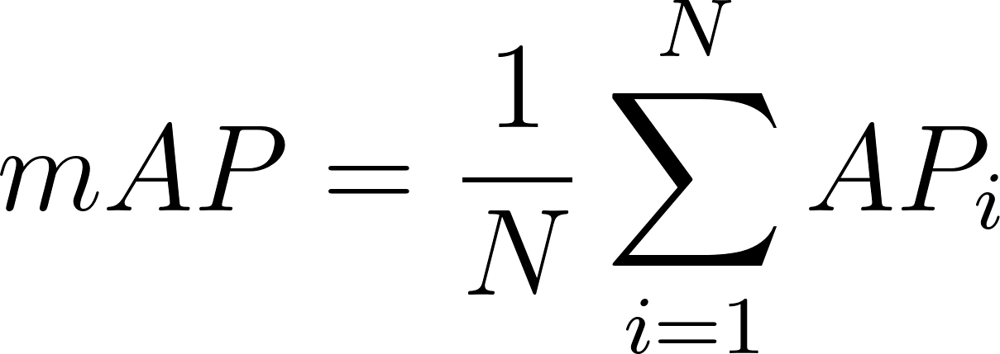
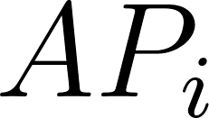
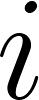

# 35

## 35. Метрики оценки качества детекции объектов: IoU, mAP.

#### IoU ⇔ Intersection over Union

0. Метрика оценки качества локализации объекта, вычисляемая как отношение площади пересечения предсказанного BBox и реального BBox к площади их объединения.

1.  — предсказанный BBox.

2.  — реальный BBox (Ground Truth).

3.  — функция вычисления площади.

4. Значение IoU находится в диапазоне \[0, 1\]. 1 означает идеальное совпадение рамок, 0 — отсутствие пересечения.

5. Порог IoU используется для классификации предсказания как TP или FP. Если вычисленное значение IoU больше заданного порога, предсказание считается TP.

AP ⇔ Average Precision ⇔ площадь под PR-кривой

0. Метрика оценки качества детекции для одного конкретного класса, численно равная площади под PR-кривой.

1. 

2.  — значение Precision в зависимости от значения Recall .

3. Характеризует способность алгоритма находить все объекты заданного класса (высокий Recall), не создавая ложных срабатываний (высокий Precision).

#### mAP ⇔ mean Average Precision

0. Итоговая скалярная метрика оценки качества работы детектора объектов на всех классах набора данных.

1. 

2.  — общее количество классов в наборе данных.

3.  — значение AP, вычисленное для класса .

4. Стандарты расчета mAP:

4.1. mAP@0.5 — метрика mAP вычисляется при фиксированном пороге IoU = 0.5 для определения TP.

4.2. mAP@\[.5:.95\] <=> COCO mAP — метрика mAP вычисляется как среднее арифметическое значений mAP, полученных при 10 различных порогах IoU: от 0.50 до 0.95 с шагом 0.05. Является строгим стандартом оценки, штрафующим за неточную локализацию рамок.
