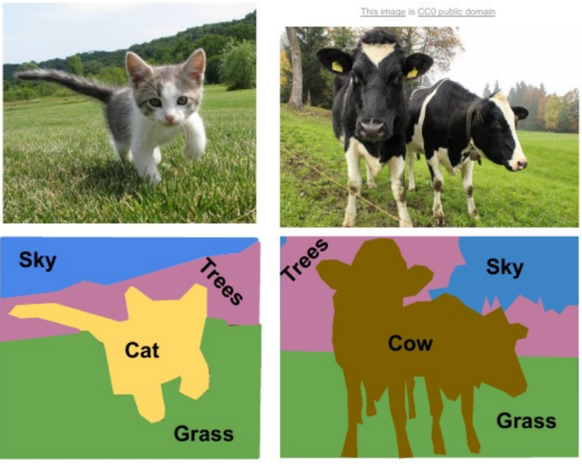
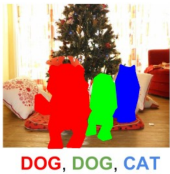

# 37

37. Семантическая и instance-сегментация: различия и применение.

Семантическая сегментация – задача классификации каждого пикселя изображения определенным классом (например: «человек», «дорога», «автомобиль», «небо»). При этом объекты одного и того же класса не разделяются между собой и рассматриваются как единое целое (одно цветовое пятно). Обычно сегментирует всё, даже фон (типа «небо», «трава»).

← SEMANTIC

Применение:

- Автопилоты: определение границ дорожного полотна, тротуаров, разметки

- Медицина: сегментация опухолей или органов на МРТ/КТ снимках (важна общая площадь и форма пораженной области)

- Сельское хозяйство: анализ спутниковых снимков для определения типов почв, лесов, водоемов

Instance-сегментация – это задача одновременного обнаружения объектов (Object Detection) и их сегментации (поэтому она сложнее семантической). Нейросеть должна не только определить класс, но и отделить каждый экземпляр одного класса друг от друга (например: «автомобиль №1», «автомобиль №2»).

Обычно сосредоточена на конкретных объектах, не интересующую нас часть картинки (фон или объекты, которые по каким-либо причинам не присутствуют в искомых классах) никак не сегментирует.

← INSTANCE

Применение:

- Подсчет объектов: подсчет количества людей в очереди, машин на парковке или клеток под микроскопом

- Робототехника: робот-манипулятор должен схватить конкретную деталь из кучи

- Редактирование фото/видео: удаление или замена конкретного человека на видео
