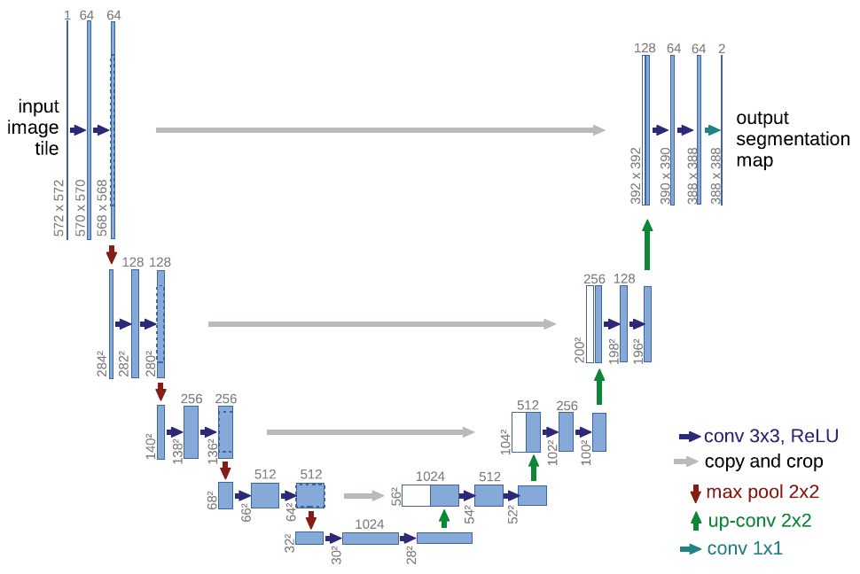
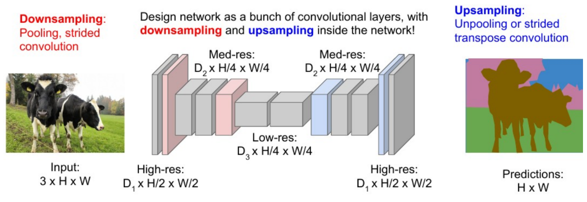

# 38

38. Архитектура U-Net и её использование в сегментации.

U-Net – полносверточная нейронная сеть, представленная О. Роннебергером в 2015 году и получившая свое название за U-образную форму графа вычислений. Изначально разрабатывалась для сегментации биомедицинских изображений, где данных мало, а точность границ критически важна.

Архитектура:

- Энкодер (сжатие): (лево – см. рис. ниже)

  - состоит из чередующихся слоев свертки (3x3) и пулинга (Max Pooling 2x2)

  - извлекает признаки и уменьшает пространственное разрешение изображения, увеличивая при этом количество каналов

  - здесь сеть понимает, что находится на изображении (контекст)

- Декодер (расширение): (право)

  - использует операции апсэмплинга (Up-sampling или Transposed Convolution)

  - цель: восстановить пространственное разрешение до исходного размера изображения

  - здесь сеть понимает, где находится объект (локализация)

- Skip Connections: (серые стрелки)

  - прямые связи, которые передают карты признаков из энкодера в соответствующий ему слой декодера (путем конкатенации/склеивания/residual connections)

  - при сжатии в энкодере теряется точная информация о границах и мелких деталях, а skip connections напоминают декодеру точные пространственные координаты пикселей, что делает границы маски очень четкими

  - решает проблемы затухания градиента и позволяет эффективно передавать информацию через множество слоев

(надеюсь, Лабинцев/Андриянов – не Макрушин, и им рисовать не надо, но на всякий)

картинка из лекции 5, что-то u-net-подобное (только skip’ов не видно):

Дополнительно можно сверяться с Татьяной.

Дополню про использованиеИспользование в сегментации началось с анализа микроскопических снимков, но быстро распространилось на другие области:

- В медицине U-Net до сих пор является базовым решением для выделения клеток, сосудов, органов и опухолей на КТ и МРТ снимках.

- В дистанционном зондировании Земли её применяют для автоматического картографирования: выделения дорог, зданий и водоемов на спутниковых снимках.

- В промышленном контроле качества используется для поиска микротрещин и дефектов на поверхностях материалов, где нужна высокая точность контуров.

Важной особенностью U-Net является её исключительная эффективность при малом количестве данных. Поскольку в медицине или узкоспециализированном производстве сложно получить тысячи размеченных экспертами снимков, U-Net проектировалась так, чтобы извлекать максимум информации из имеющихся примеров. В оригинальной работе авторы использовали агрессивную аугментацию данных (включая эластичные деформации), что позволило сети успешно обучаться даже на нескольких десятках изображений.
