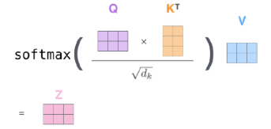
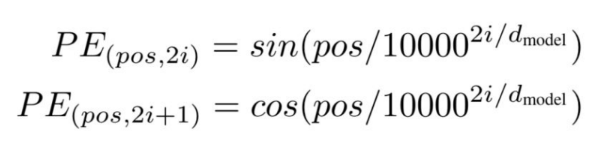

# 40

40. Понятие трансформеров и механизм self-attention.

Вообще, в презах Андриянова почти 0 инфы, даже то, что ниже, – это уже больше, чем у него. Возможно, стоит повторять по Арсению.

Трансформер – архитектура нейронных сетей, изначально созданная для обработки текстов, но адаптированная для изображений в 2020 году (ViT, Vision Transformer). Рассматривает изображение как последовательность фрагментов (патчей) и способен сразу находить связи между удаленными частями изображения.

- Энкодер

  - Последовательность self-attention блоков и полносвязных слоев

  - Residuals и LayerNorm

- Декодер

  - Архитектура для задач, когда размерность выходов должна отличаться от размерности входов (например, перевод)

Self-attention (эта часть почти совсем из презы Макруши)

Принцип работы:

- Каждый токен напрямую сопоставляется со всеми остальными токенами

- Для каждой пары токенов вычисляется вес их взаимосвязи

- Итоговое представление входа (слова/патчи из картинки) = взвешенная сумма всех входных токенов

Ключевые преимущества:

- Прямой доступ к любому токену последовательности (O(1))

- Параллельные вычисления для всей последовательности

- Динамический учет контекста токена (слов/окружающих объектов/пикселей)Формула Attention(Q,K,V) = z

- Q: что ищем

- K: где ищем

- V: что извлекаем

Multi-head attention: несколько модулей self-attention работают параллельно, каждая голова учится искать свой тип связей (например, цвета, текстуры, формы). Результаты голов конкатенируются.

Position encoding: т.к. Self-attention не различает порядок токенов, нужно явное указание на позицию каждого. Обычно реализуется через синусоидальное кодирование с разными частотами:

Для картинок позиции кодируются комбинациями синусов и косинусов сразу по двум осям (х и у). При изменении разрешения сетки формулу можно легко пересчитать под новый размер.

Vision Transformer (ViT)

Так как трансформер работает с последовательностями, изображение нужно подготовить:

- Patching: изображение разбивается на квадраты – патчи (например, 16x16 пикселей), которые играют роль токенов

- Linear Projection: каждый патч превращается в плоский вектор (эмбеддинг)

- Position Embedding: добавляем к векторам информацию об их координатах

- Transformer Encoder: прогон через слои Self-Attention и полносвязные слои

Еще существует Axial Self-Attention: отдельные Attention для каждой оси. Хотя на каждом отдельном шаге пиксель видит только свою строку или столбец, при последовательном применении (например, сначала по высоте, потом по ширине) информация успевает распространиться по всему изображению. Модель сохраняет глобальное поле зрения, но вычислительно это гораздо проще, чем делать аттеншн по целому изображению, вытянутому в один вектор (получаем сложность O(H\*W\*(H+W) вместо O(H^2 \* W^2)).
