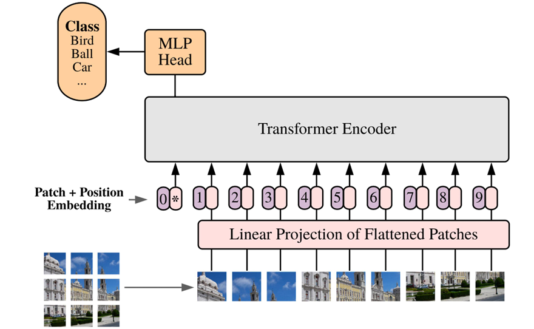

# 41

41. Архитектура Vision Transformer (ViT).

Главная идея ViT перенести Transformer из NLP на обработку изображений. Здесь используются патчи (аналог токенов в тексте), т. е. обрабатывается изображение не целиком, а разбивается на части.

Архитектура:

- Пикча поступает целиком и внутри разбивается на патчи.

- Эти части преобразуются из двумерки в одномерку (короче, flatten делаем) и прогоняются через линейный слой (Linear Projection) и получаются по сути эмбеддинги.

- В начало присоединяется токен CLS (это 0\*). Затем одномерные позиционные эмбеддинги для учета последовательности патчей.

- Полученная последовательность поступает в Transformer Encoder, где с помощью self-attention смотрятся взаимосвязи между патчами.

- На выходе мы берем вектор 0\* и на основе MLP (многослойного перцептрона) предсказываем класс объекта входной пикчи.
