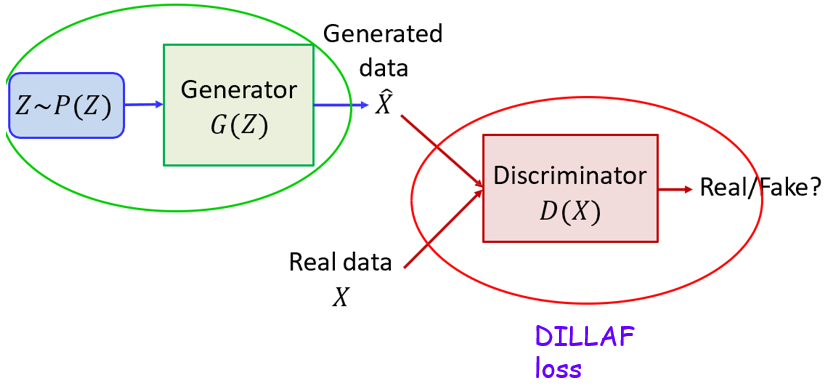
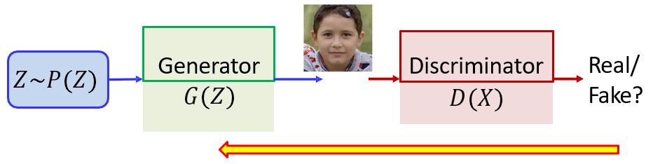
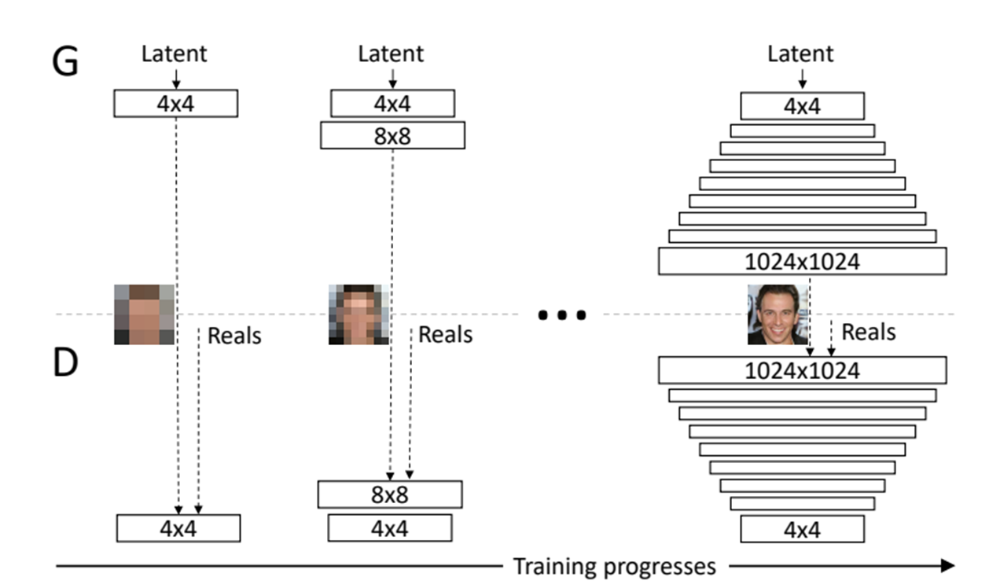
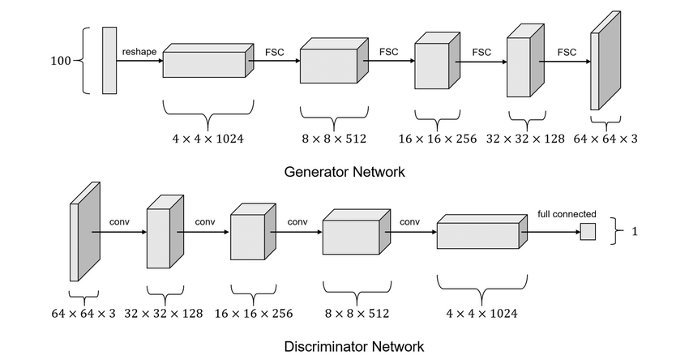
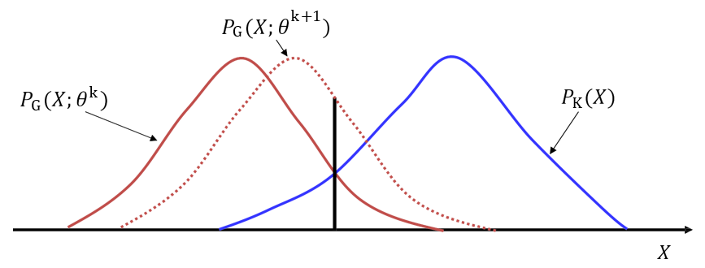
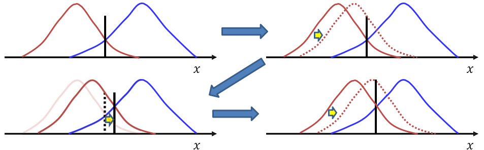
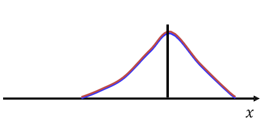

# 45

## 45. Генерация изображений с использованием GAN.

- Спасибо Елизавете Евгеньевне Васильевой за предоставленные удобства

рада стараться 🥰

Состязательное обучение GAN (Generative Adversarial Networks) состоит из двух конкурирующих сетей (противников), которые пытаются превзойти друг друга.

Генератор (Generator, G):

- Задача: Создавать реалистичные объекты (например, изображения лиц) из случайного вектора шума Z, взятого из известного распределения (например, нормального Гауссовского).

- Цель: Обучиться создавать такие данные, распределение которых (P\_G) максимально соответствует распределению реальных данных (P\_K).

Дискриминатор (Discriminator, D):

- Задача: Выступать в роли классификатора, который получает на вход либо реальные данные из обучающей выборки (X), либо синтетические данные от генератора (X^).

- Цель: Обучиться безошибочно отличать реальные объекты от «подделок». На выходе он выдает вероятность того, что объект является настоящим.

- Дискриминатор фактически выполняет роль динамической функции потерь (DILLAF loss) для генератора.

Обучение представляет собой минимаксную оптимизацию, где одна сеть пытается минимизировать ошибку, а другая — максимизировать вероятность распознавания.

Алгоритм обучения (итеративный процесс):

- Шаг 1 (Обучение дискриминатора): Дискриминатору предъявляются реальные и синтетические примеры. Его веса обновляются так, чтобы:

  - максимизировать значение log D(x) для реальных лиц и log(1−D(G(z))) для синтетических.

  - получить D(x)=1 для настоящих лиц и D(x)=0 (т.е. 1 − D(x)=1) для синтезированных лиц.

- Шаг 2 (Обучение генератора): Потери дискриминатора через обратное распространение ошибки передаются генератору. Генератор учится «обманывать» дискриминатор, корректируя свои веса так, чтобы дискриминатор принимал его выходы за реальные (D(G(z))→1, т.е. минимизируем 1 − D(G(z))→0)

Архитектуры глубоких моделей в GAN:

- Progressive GAN: Постепенное обучение модели от низкого разрешения (4x4) до высокого (1024x1024) путем добавления новых слоев в процессе обучения. Это позволяет достичь высокого фотореализма.

- StarGAN: Модель, способная выполнять перевод изображений между несколькими доменами одновременно (например, менять возраст, пол и цвет волос лица одной сетью).

- DCGAN (Deep Convolutional GAN): Вариация с использованием глубоких сверточных сетей.

Принцип подхода к обучению (на примере одномерного распределения)

Начало: Распределение данных генератора (P\_G, красная линия) и реальных данных (P\_K, синяя линия) сильно различаются. Дискриминатор выстраивает «идеальную границу» между ними.

Процесс: Генератор корректирует свои параметры так, чтобы сместить свое распределение в область, которую дискриминатор считает «реальной» (за границу принятия решения).

Итерация: После смещения генератора дискриминатор переучивается, находя новую границу. Процесс повторяется многократно.

Сходимость (Идеал): В точке оптимума распределение генератора идеально совпадает с реальным распределением (P\_G = P\_K). В этом случае идеальный дискриминатор не может найти различий и выдает вероятность 0.5 (случайное угадывание) для любого объекта.

