# 46

## 46. Диффузионные модели генерации изображений.

| Коротко для ответа: Диффузионная модель генерирует изображение, обращая процесс зашумления: при обучении она предсказывает добавленный шум на разных шагах, а при генерации стартует с гауссова шума и постепенно очищает его. В text-to-image варианте обратный процесс управляется текстовым embedding через attention или guidance. |
| --- |

Диффузионные модели относятся к вероятностным генеративным моделям. Их удобно понимать через две цепочки: прямую, где данные постепенно превращаются в шум, и обратную, где обученная нейросеть восстанавливает сигнал.

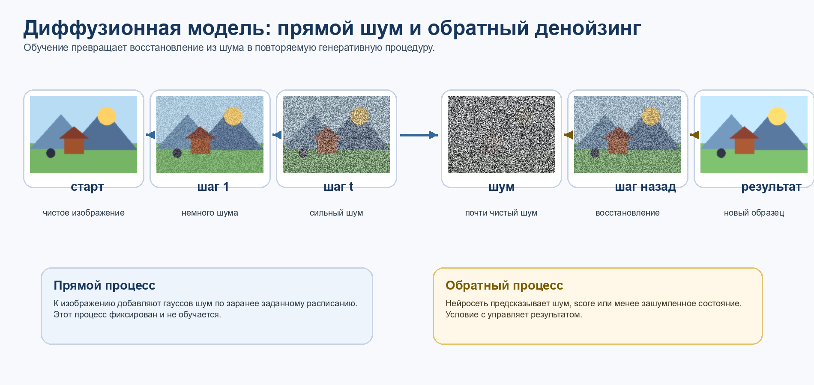

Рисунок 1. Прямой процесс добавляет шум, обратный процесс учится удалять шум и порождать новое изображение. Авторская схема.

### 46.1. Математическая идея

Пусть 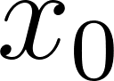 - реальное изображение из обучающего набора. Прямой процесс  задает последовательность 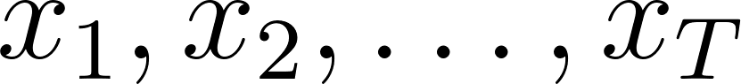, где на каждом шаге к изображению добавляется небольшая порция гауссова шума. При достаточно большом  распределение 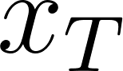 становится близким к стандартному нормальному шуму.

Обратный процесс 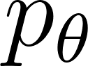 параметризуется нейросетью. Она получает зашумленное изображение 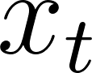, номер шага 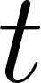 и, в условной генерации, условие : текстовый prompt, класс, маску, глубину, позу или bounding box. Цель модели - предсказать 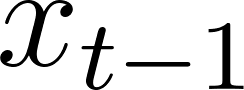, добавленный шум 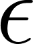 или score.

На практике распространена функция потерь, где модель предсказывает шум 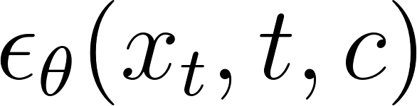, а обучение минимизирует ошибку между настоящим шумом  и предсказанным шумом. Это превращает генерацию в устойчивую задачу денойзинга.

| Термин | Смысл |
| --- | --- |
| 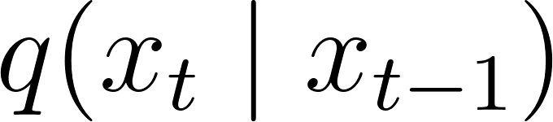 | Фиксированное добавление шума к данным. |
| 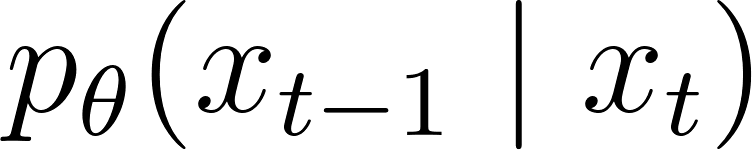 | Обученный обратный шаг восстановления. |
| 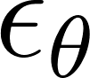 | Сеть, которая часто предсказывает добавленный шум. |
| timestep  | Индекс уровня шума. |
| condition  | Текст, класс, маска, bounding box, pose, depth или другой сигнал управления. |

### 46.2. Обучение и генерация по шагам

- Берется реальное изображение  из датасета.

- Случайно выбирается шаг , и по известной формуле получается зашумленное .

- Нейросеть получает  и , а при условной генерации также embedding условия .

- Модель предсказывает шум или score; ошибка считается между предсказанием и фактическим шумом.

- На инференсе берется случайный , затем модель много раз применяет обратный шаг, пока не получится 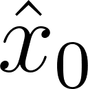.

Один и тот же денойзер учится работать на разных уровнях шума: от почти разрушенного изображения до почти чистого. Поэтому он должен понимать и глобальную композицию, и мелкие детали.

### 46.3. DDPM, score-based models и денойзинг

DDPM формулирует генерацию как марковскую цепочку латентных переменных. Работа Ho, Jain, Abbeel (2020) связала diffusion probabilistic models с denoising score matching. Интуитивно score показывает направление, в котором шумный образец становится более похожим на данные.

Score-based взгляд полезен: модель не хранит готовые картинки, а учит поле направлений в пространстве изображений. Если стартовать из шума и много раз двигаться в сторону распределения данных, получается новый образец.

### 46.4. Latent Diffusion Models

Рисунок 2. Latent Diffusion переносит денойзинг из пикселей в латентное пространство автоэнкодера и использует cross-attention для условий. Авторская схема.

Пиксельные diffusion-модели дороги: каждый шаг работает с большим изображением. Latent Diffusion сначала сжимает изображение в латентное представление z, затем обучает diffusion в этом пространстве, а decoder переводит результат обратно в пиксели.

Ключевой практический вклад LDM - гибкое подключение условий через cross-attention. Text encoder переводит prompt в токены, а U-Net использует их, чтобы согласовать изображение с запросом.

### 46.5. Text-to-image, guidance и sampler

Рисунок 3. В text-to-image pipeline важны prompt, text encoder, sampler, guidance scale и проверка результата. Авторская схема.

Classifier-free guidance усиливает влияние условия: модель сравнивает условное и безусловное предсказание и делает шаг в сторону лучшего соответствия prompt. Слишком большой guidance scale может давать перенасыщенность, странные текстуры и менее естественные изображения.

Sampler определяет, как проходить обратную траекторию: DDPM ближе к исходной стохастической процедуре, DDIM ускоряет генерацию, DPM-Solver и Euler-подобные методы используют более эффективные численные шаги.

### 46.6. Сравнение с GAN и VAE

| Подход | Идея | Сильные стороны | Слабые стороны |
| --- | --- | --- | --- |
| VAE | Кодирование в латентное распределение и декодирование. | Стабильное обучение, явная латентная структура. | Часто размытые изображения. |
| GAN | Соревнование генератора и дискриминатора. | Резкие изображения и быстрый инференс. | Mode collapse, нестабильное обучение. |
| Diffusion | Обращение постепенного зашумления. | Качество, разнообразие, гибкое управление. | Много шагов инференса, высокая стоимость обучения. |

### 46.7. Применения

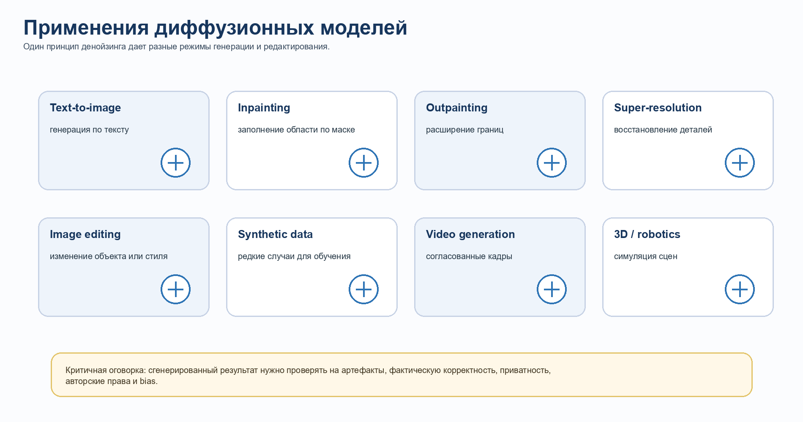

Рисунок 4. Основные режимы применения diffusion: генерация, редактирование, восстановление, синтетические данные, видео и 3D. Авторская схема.

- Text-to-image: создание изображения по текстовому описанию.

- Inpainting: восстановление или замена части изображения по маске.

- Outpainting: продолжение изображения за исходные границы.

- Image-to-image editing: изменение стиля, освещения, материала, фона или объекта.

- Super-resolution и restoration: повышение разрешения и восстановление деталей.

- Synthetic data: генерация редких условий для обучения detector/segmenter.

- Video generation: расширение diffusion на временную согласованность кадров.

### 46.8. Ограничения и риски

- Медленный инференс: последовательные шаги дороже одного прямого прохода генератора.

- Галлюцинации: модель может создавать реалистичные, но фактически неверные детали.

- Ошибки в тексте, руках, счете объектов и строгой геометрии остаются типичными.

- Зависимость от обучающих данных: bias, стили, авторские права и приватность.

- Сложная оценка: FID, CLIPScore и human preference измеряют разные аспекты качества.

### 46.9. Связь с локальными лекциями

В лекциях курса нет отдельного слайда по diffusion. Связь с курсом при этом прямая: CNN и U-Net дают основу денойзера; Transformer и self-attention нужны для глобального контекста и текстового управления; detection/segmentation дают условия для редактирования по маске, bounding box и структуре сцены.

Рисунок 5. Self-attention как механизм, позволяющий связывать разные токены изображения или текста. Источник: лекция 7, слайд 7.

Источники раздела 46: Ho et al., DDPM, arXiv:2006.11239; Rombach et al., LDM, arXiv:2112.10752; Peebles and Xie, DiT, arXiv:2212.09748; Ramesh et al., CLIP Latents, arXiv:2204.06125; Brooks et al., InstructPix2Pix, arXiv:2211.09800.
