# 47

## 47. Автоматическое описание изображений (Image Captioning)

| Коротко для ответа: Image Captioning - задача на стыке computer vision и NLP: модель получает изображение и генерирует текстовое описание. Типовой pipeline состоит из визуального энкодера, attention или выделения регионов и языкового декодера. Современные методы расширяют captioning до grounded captions, VQA, visual instruction following и графов сцен. |
| --- |

Captioning требует не просто классифицировать главный объект, а выбрать релевантные объекты, атрибуты, действия и отношения, затем выразить их грамматически корректным текстом.

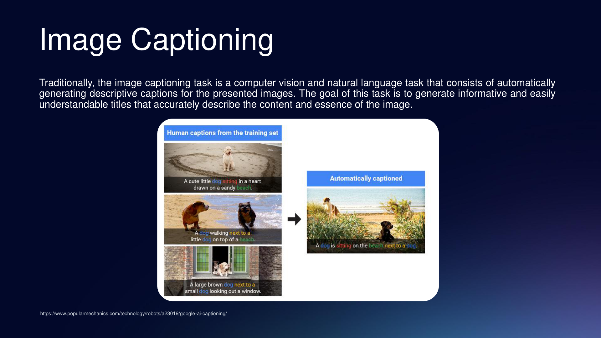

Рисунок 6. Image Captioning как задача автоматической генерации описания изображения. Источник: лекция 8, слайд 3.

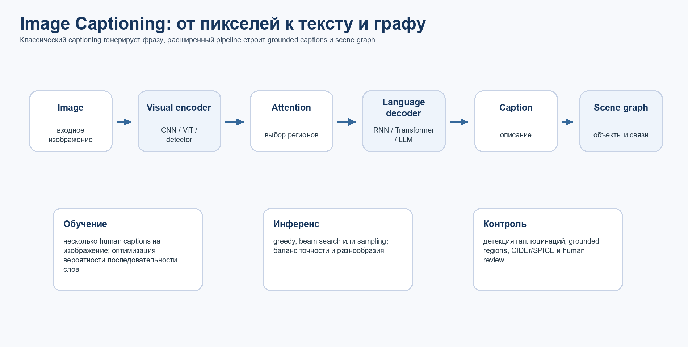

Рисунок 7. Расширенный pipeline: изображение, затем визуальный энкодер, attention, языковой декодер, caption и scene graph. Авторская схема.

### 47.1. Что должна сделать модель

- Распознать главные сущности: люди, животные, транспорт, предметы, фон, сцена.

- Определить атрибуты: цвет, размер, поза, состояние, материал, стиль.

- Выделить действия: стоит, сидит, держит, едет, смотрит, играет.

- Выразить отношения: человек держит зонт, собака сидит на пляже, машина на дороге.

- Сформировать связную фразу без невидимых фактов.

### 47.2. Классическая архитектура Image2Text

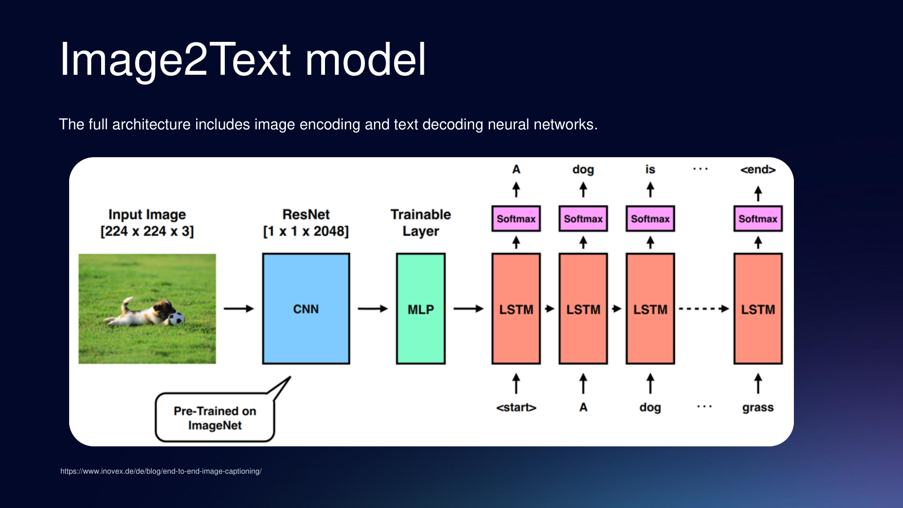

Рисунок 8. Полная архитектура Image2Text: image encoding и text decoding. Источник: лекция 8, слайд 5.

Классический encoder-decoder подход: визуальный encoder превращает изображение в вектор или набор признаков, а decoder генерирует слова одно за другим. Ранние модели часто использовали CNN + LSTM; более поздние методы добавили attention.

Attention позволяет при генерации слова dog смотреть на область с собакой, при слове beach - на фон, а при словах next to - на взаимное расположение объектов.

### 47.3. Энкодер изображения: CNN, ViT, detector

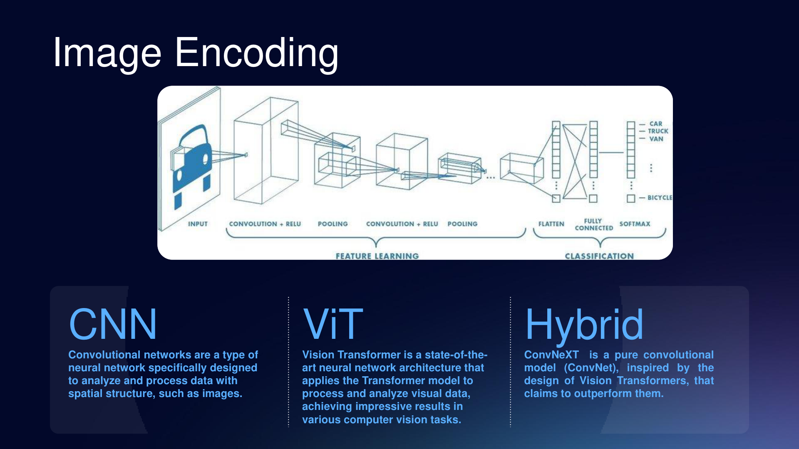

Рисунок 9. Image Encoding: CNN, ViT и гибридные модели. Источник: лекция 8, слайд 7.

| Энкодер | Как работает | Когда полезен |
| --- | --- | --- |
| CNN | Строит иерархию локальных признаков через свертки. | Локальные текстуры, объекты, эффективный инференс. |
| ViT | Разбивает изображение на патчи и применяет self-attention. | Большие данные, глобальный контекст, мультимодальность. |
| Hybrid | Сочетает свертки и transformer-блоки. | Компромисс между CNN bias и гибкостью attention. |
| Detector/region encoder | Сначала выделяет объекты или регионы. | Grounded captions, scene graph, объяснимость. |

### 47.4. Декодер текста и decoding strategy

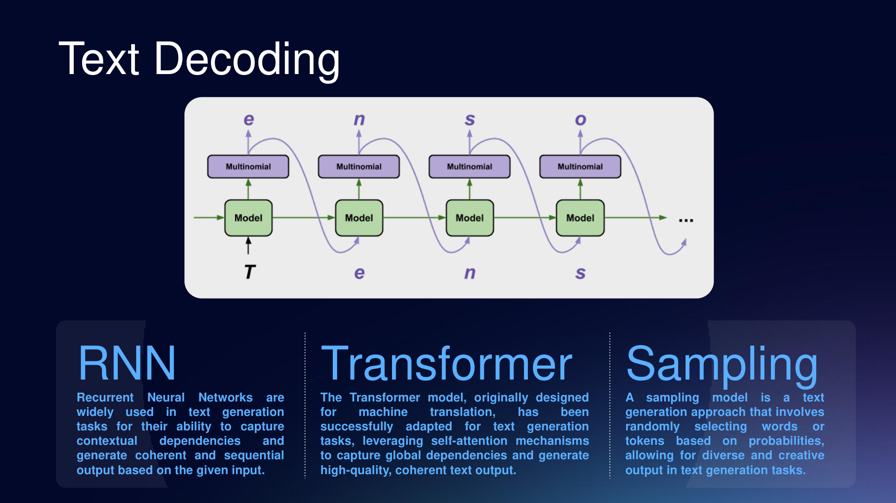

Рисунок 10. Text Decoding: RNN, Transformer и sampling. Источник: лекция 8, слайд 9.

RNN/LSTM генерируют последовательность через скрытое состояние. Transformer-декодер использует self-attention и cross-attention, лучше связывает слова с визуальными признаками и масштабируется с предобучением.

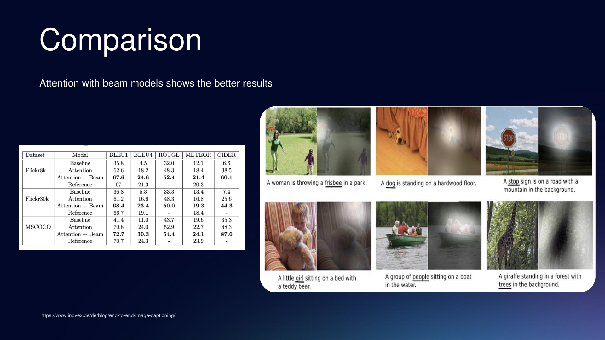

Рисунок 11. Attention with beam models показывает лучшие результаты на captioning-метриках. Источник: лекция 8, слайд 6.

### 47.5. Современные vision-language модели

Современный captioning обычно использует предварительное обучение на больших парах изображение-текст. CLIP сопоставляет изображение и текст в общем embedding-пространстве; BLIP и BLIP-2 расширяют это до генерации, VQA и zero-shot image-to-text; LLaVA-подобные системы соединяют visual encoder с LLM и учатся следовать мультимодальным инструкциям.

| Подход | Что добавляет |
| --- | --- |
| CLIP-like contrastive pretraining | Общий embedding для изображения и текста, zero-shot перенос. |
| BLIP / BLIP-2 | Понимание и генерация, caption bootstrapping, связь с LLM. |
| Visual instruction tuning | Ответы на вопросы, рассуждение, следование инструкциям. |
| Grounded captioning | Связь фраз с регионами, меньше галлюцинаций. |

### 47.6. Text2Graph и графы сцен

Одна подпись часто теряет структуру. Граф сцены хранит сущности, действия, атрибуты и отношения, поэтому подходит для поиска, reasoning и объяснимости.

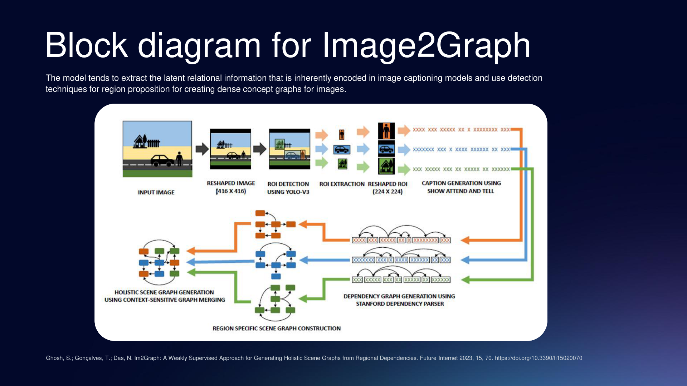

Рисунок 12. Блок-схема Image2Graph: извлечение регионов, локальных описаний и плотного концептуального графа. Источник: лекция 8, слайд 12.

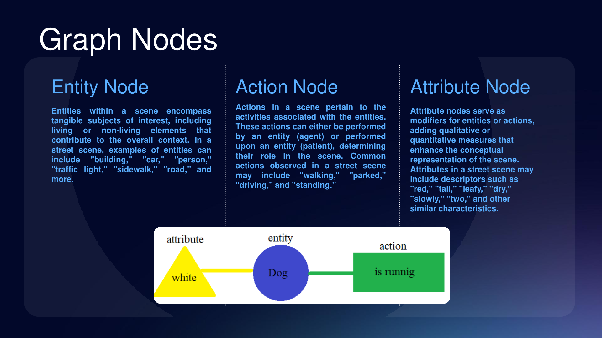

Рисунок 13. Типы узлов графа сцены: Entity Node, Action Node, Attribute Node. Источник: лекция 8, слайд 13.

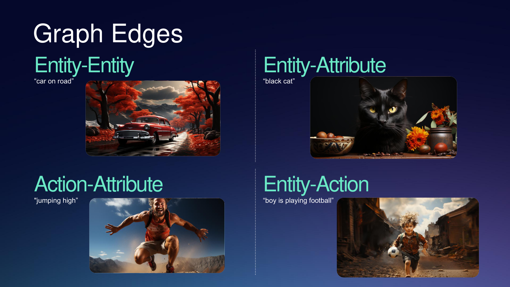

Рисунок 14. Типы ребер графа сцены: Entity-Entity, Entity-Attribute, Action-Attribute, Entity-Action. Источник: лекция 8, слайд 14.

Например, подпись boy is playing football можно представить как entity = boy, action = playing, entity = football и связи boy to playing, playing to football. Для сложной сцены это полезнее одной строки.

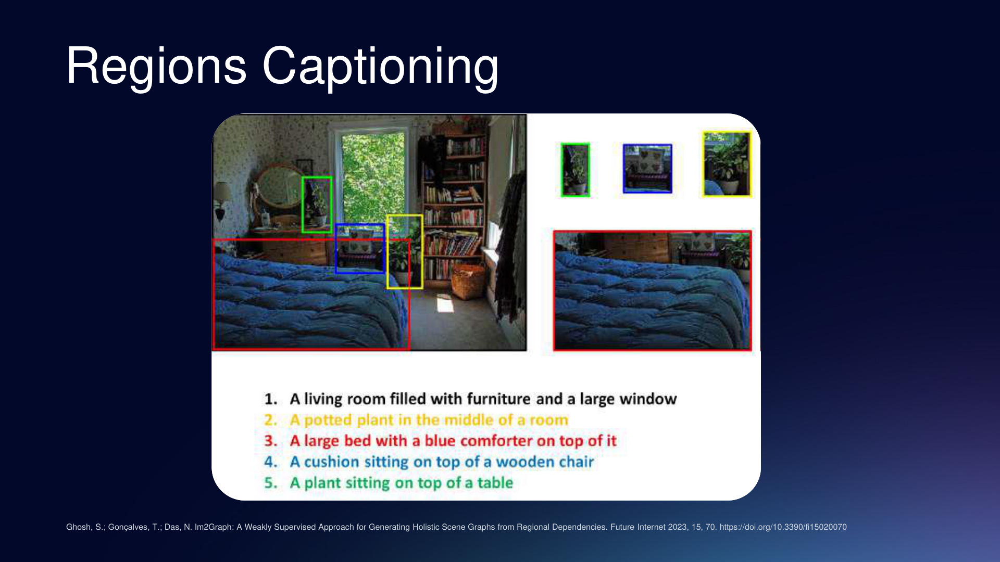

Рисунок 15. Regions Captioning: локальные подписи регионов используются для построения полного описания сцены. Источник: лекция 8, слайд 15.

### 47.7. Метрики и контроль качества

| Метрика | Что измеряет | Ограничение |
| --- | --- | --- |
| BLEU | Совпадение n-грамм. | Плохо ловит смысловые эквиваленты. |
| METEOR | Совпадения слов и порядок. | Зависит от эталонных фраз. |
| ROUGE | Перекрытие фрагментов текста. | Не проверяет изображение. |
| CIDEr | Согласованность с human captions. | Может поощрять шаблонность. |
| SPICE | Семантика через graph-like разбор. | Зависит от парсинга. |
| Human evaluation | Точность, полезность, безопасность. | Дорого и медленно. |

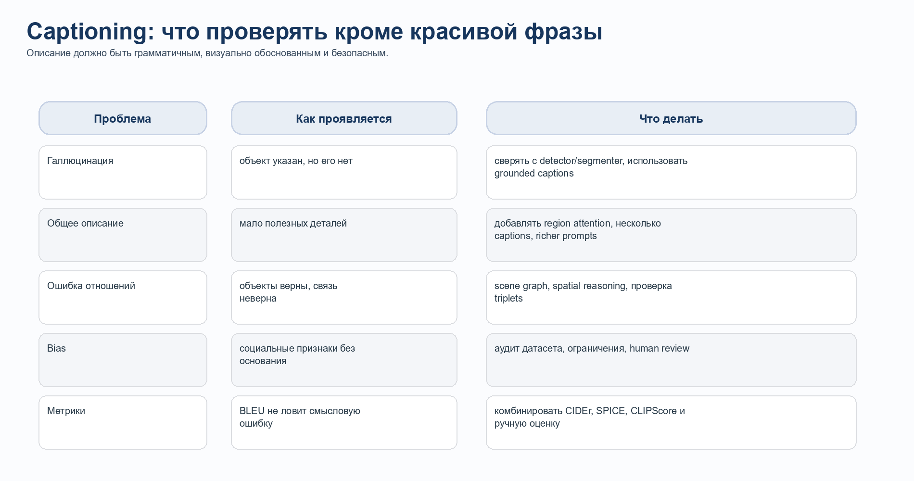

Рисунок 16. Основные ошибки captioning и способы контроля качества. Авторская схема.

### 47.8. Применения и ограничения

- Доступность: alt-text и аудиоописания.

- Поиск и архивы: индексирование изображений по содержанию.

- E-commerce: описание товаров, цвета, материала, стиля.

- Социальные сети и медиа: подписи, хештеги, moderation assistance.

- Робототехника: перевод сцены в языковые команды и графы действий.

- Медицина и промышленность: предварительные описания с обязательной экспертной проверкой.

- Типичные ошибки: hallucination, неверный атрибут, неверное отношение, count error, bias.

Источники раздела 47: лекция 8; Radford et al., CLIP, arXiv:2103.00020; Li et al., BLIP, arXiv:2201.12086; Li et al., BLIP-2, arXiv:2301.12597; Liu et al., LLaVA, arXiv:2304.08485; Ghosh et al., Im2Graph, Future Internet 2023.
