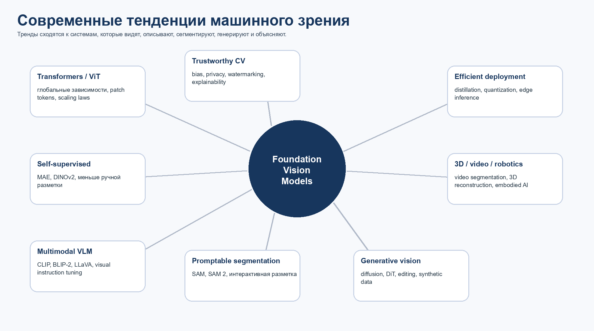
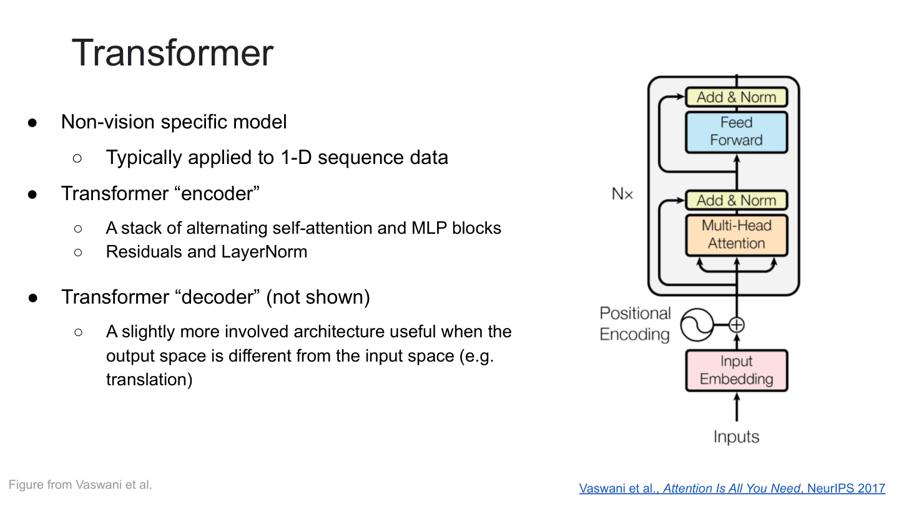
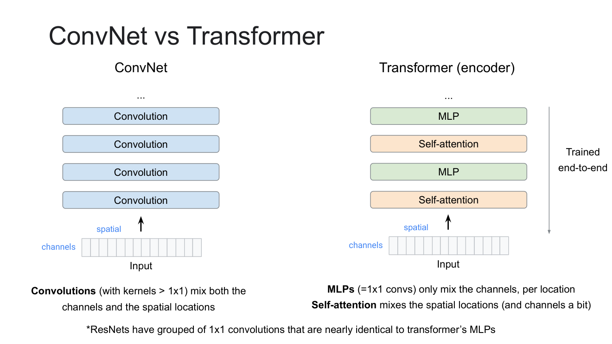
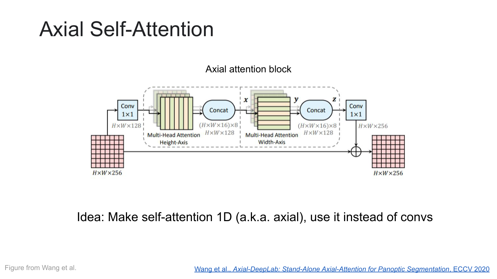
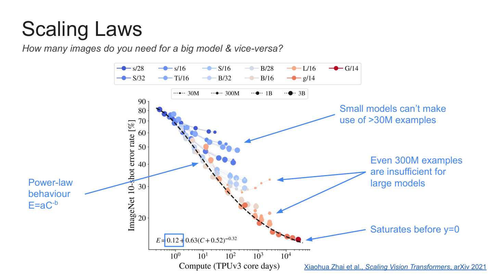
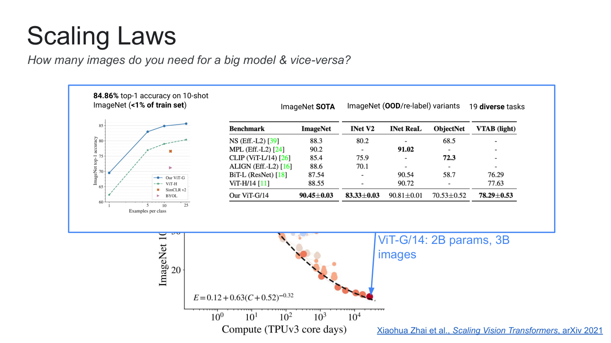
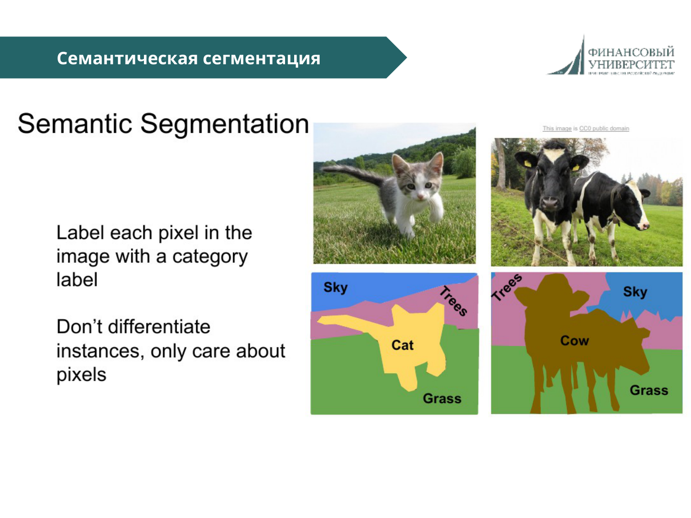
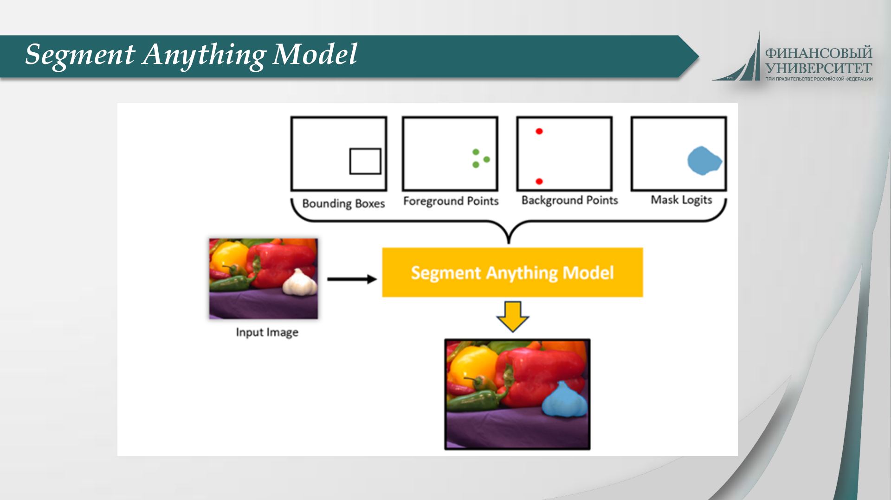
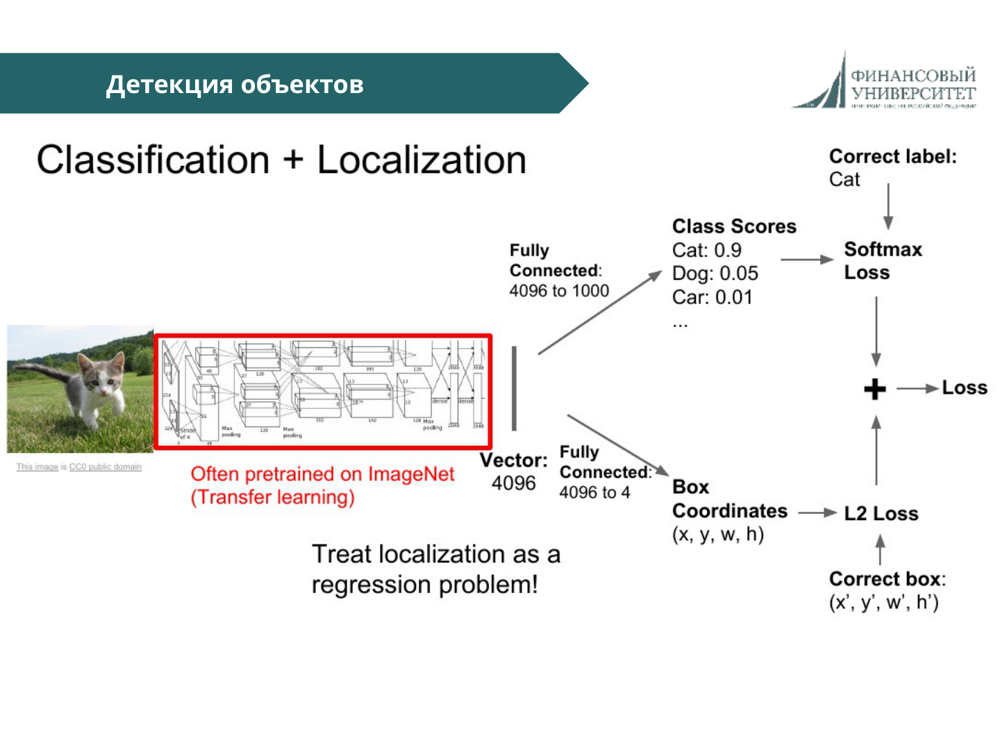

# 48

## 48. Современные тенденции и перспективы развития машинного зрения.

| Коротко для ответа: Главная тенденция машинного зрения - переход от узких моделей под одну задачу к крупным предобученным foundation-моделям, которые объединяют распознавание, сегментацию, описание, генерацию, видео, 3D и язык. |
| --- |

Современная система может одновременно искать объекты, сегментировать, отвечать на вопросы, строить подпись, редактировать изображение и работать с видео. Это стало возможным за счет масштабирования данных, моделей и мультимодального обучения.

Рисунок 17. Карта ключевых тенденций современного машинного зрения. Авторская схема.

### 48.1. От CNN к Vision Transformer

Рисунок 18. Transformer encoder: self-attention, MLP, residual connections и LayerNorm. Источник: лекция 7, слайд 6.

CNN долго доминировали благодаря локальному inductive bias. Transformer слабее предполагает локальность, но масштабируется и моделирует глобальные взаимодействия через self-attention. Поэтому ViT требует больше данных, но при большом масштабе становится очень сильным.

Рисунок 19. ConvNet vs Transformer: свертки смешивают локальные признаки, self-attention смешивает позиции глобально. Источник: лекция 7, слайд 13.

Проблема vision-transformer подхода - квадратичная сложность attention по числу токенов. Поэтому развиваются local attention, axial attention, window attention, sparse attention и иерархические архитектуры.

Рисунок 20. Axial Self-Attention как способ снизить стоимость attention для пространственных данных. Источник: лекция 7, слайд 20.

### 48.2. Scaling laws и большие модели

Рисунок 21. Scaling laws: большие модели требуют больших данных и вычислений. Источник: лекция 7, слайд 27.

Рисунок 22. Масштабирование ViT-G/14 и перенос на разные задачи. Источник: лекция 7, слайд 28.

Вывод из scaling laws: архитектура важна, но решающими становятся масштаб данных, compute, очистка датасета и режим предобучения.

### 48.3. Self-supervised и weakly supervised pretraining

Ручная разметка дорога. Поэтому растет роль обучения без полной разметки: contrastive learning, masked image modeling, self-distillation и teacher-student схемы. MAE учит восстанавливать скрытые патчи; DINOv2 показывает, что self-supervised ViT на curated data дает универсальные признаки.

| Подход | Сигнал | Почему это важно |
| --- | --- | --- |
| Contrastive learning | Сблизить image-text или image-image пары. | Zero-shot и переносимые embeddings. |
| Masked image modeling | Восстановить скрытые патчи. | Масштабируемое обучение ViT. |
| Self-distillation | Student повторяет teacher. | Сильные признаки без labels. |
| Weak supervision | Шумные web labels и captions. | Масштаб лучше ручной аннотации. |

### 48.4. Мультимодальные vision-language models

Зрение перестало быть изолированным. CLIP связывает изображение и текст; BLIP/BLIP-2 добавляют генерацию и VQA; LLaVA показывает, как visual instruction tuning превращает модель в ассистента, который обсуждает изображение и следует инструкциям.

Это связывает вопросы 47 и 48: image captioning становится интерфейсом между зрением и языком, а не отдельной задачей.

### 48.5. Promptable segmentation и SAM

Рисунок 23. Семантическая сегментация: каждому пикселю назначается категория. Источник: лекция 5, слайд 35.

Рисунок 24. Segment Anything Model как пример promptable/foundation-подхода к сегментации. Источник: лекция 6, слайд 37.

SAM меняет постановку: вместо segmenter под каждый набор классов модель получает prompt - точку, рамку, маску или иной сигнал - и возвращает маску объекта. SAM 2 расширяет идею на изображения и видео.

### 48.6. Detection, segmentation и grounding

Рисунок 25. Classification + Localization как базовый шаг к detection и grounded understanding. Источник: лекция 5, слайд 44.

Даже крупным мультимодальным моделям нужны detection, localization, segmentation и tracking. Эти задачи дают grounding: связь между утверждением и конкретной областью изображения.

### 48.7. Генеративное зрение, 3D и видео

Генеративные модели стали частью CV-конвейера: они создают данные, редактируют изображения, восстанавливают повреждения и помогают визуализировать гипотезы. Для видео главным вызовом остается временная согласованность объектов и физики.

| Направление | Что дает |
| --- | --- |
| Video understanding | Понимание действий, событий и временных связей. |
| Tracking и video segmentation | Сохранение идентичности объектов во времени. |
| 3D reconstruction | Переход от картинки к геометрии сцены. |
| Gaussian Splatting | Быстрое построение новых видов сцены. |
| Embodied AI | Связь восприятия с планированием и действием. |

### 48.8. Эффективность, надежность и этика

- Эффективность: distillation, pruning, quantization, efficient attention, edge inference.

- Robustness: устойчивость к шуму, доменному сдвигу, редким случаям и adversarial-примерам.

- Bias: ошибки могут быть неравномерны по группам людей, географиям, стилям съемки и классам.

- Explainability: нужны bounding boxes, masks, scene graph или textual rationale.

- Privacy: изображения могут содержать лица, документы, номера, геолокацию и медицинские данные.

- Authenticity: генеративное зрение требует watermarking, provenance и detection synthetic content.

### 48.9. Перспективы

Вероятная перспектива - не исчезновение CNN/detectors, а их включение в крупные гибридные системы. CNN полезны для эффективных локальных признаков; transformers дают глобальный контекст; VLM связывают изображение с языком; diffusion добавляет генерацию; графы сцен улучшают reasoning.

Линия развития выглядит так: classification, затем detection, segmentation, captioning, vision-language reasoning, generative and embodied vision. Каждый следующий уровень использует предыдущий как модуль или источник supervision.

Источники раздела 48: лекции 5-7; Dosovitskiy et al., ViT, arXiv:2010.11929; He et al., MAE, arXiv:2111.06377; Oquab et al., DINOv2, arXiv:2304.07193; Kirillov et al., SAM, arXiv:2304.02643; Ravi et al., SAM 2, arXiv:2408.00714; Kerbl et al., 3D Gaussian Splatting, arXiv:2308.04079.
